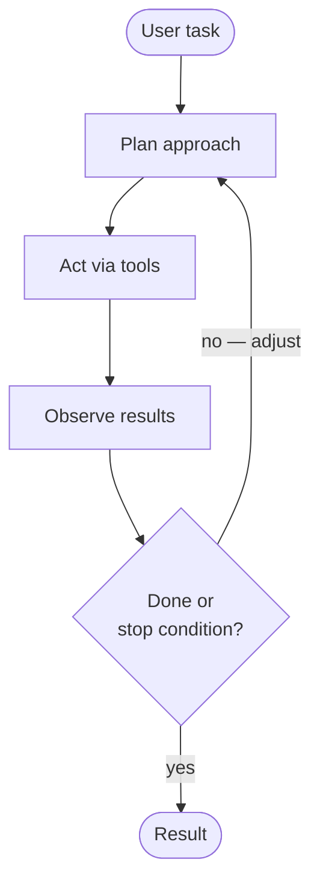
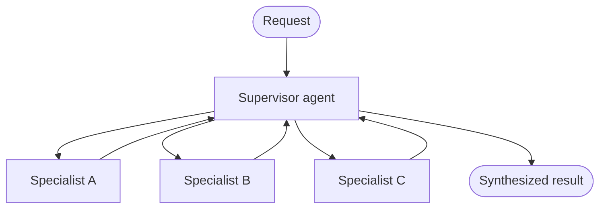
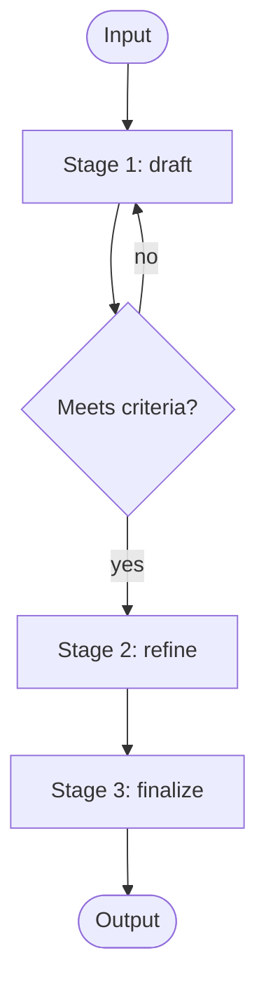
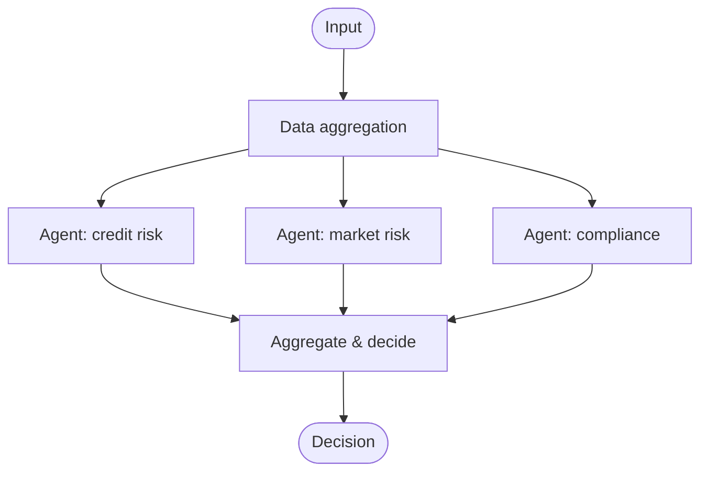
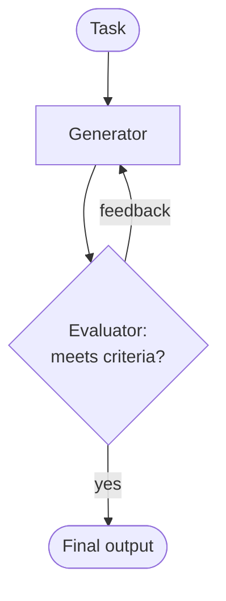
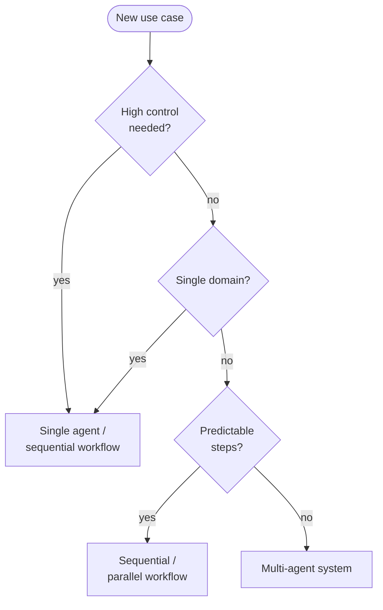

# Building Effective AI Agents

> Notes from Anthropic's *Building Effective AI Agents: Architecture Patterns and
> Implementation Frameworks* ([PDF](https://resources.anthropic.com/hubfs/Building%20Effective%20AI%20Agents-%20Architecture%20Patterns%20and%20Implementation%20Frameworks.pdf)).
> Paraphrased for study.

**Generative AI answers questions. AI agents solve problems.** An agent is an LLM
that *autonomously directs its own process and tool usage* — it assesses a task,
picks tools, tries an approach, evaluates the result, and adjusts. Traditional
automation runs rigid pre-written scripts; an agent maintains dynamic control and
adapts to feedback, so it fits work where the exact steps can't be predetermined
(incident response, onboarding flows, data analysis, dev workflows with test loops).

The North Star throughout: **match technical complexity to business value. Start
simple, measure everything, add complexity only when it delivers measurable gains.**

## Design best practices

| Principle | What it means |
|-----------|---------------|
| **Start simple, scale intelligently** | Begin with single-purpose agents; evolve only as requirements demand. Simple systems are cheaper, easier to debug, and tie to clear metrics. |
| **Choose the right model** | Balance capability vs speed vs cost. Don't run simple, high-volume tasks through a premium model; don't run complex reasoning through a light one. |
| **Modular design** | Centralize prompts, make tools discrete reusable modules, compose agents from only what they need. Lets you adopt new capabilities without redesigning infrastructure. |
| **Extend with Skills** | Package domain expertise/workflows/tool integrations as modular Skills agents invoke when needed — instead of stuffing everything into prompts. |
| **Observability first** | AI systems are non-deterministic black boxes. You need visibility into prompt chains, decision paths, retrieval context, and token use — a stack trace isn't enough. |

## Single-agent systems

An agent runs a continuous loop: **perceive → decide → act**, repeating until the
task is done or it hits a stop condition (e.g. "pause for human review").

Core components: an **LLM** (reasoning engine), a **prompt** (role + capabilities),
a **toolkit** of integrations (e.g. via MCP), and optional **Skills**.

::: details When to use / avoid
**Use** for open-ended problems where the path isn't clear up front — you can't
predetermine how many steps are needed.

**Avoid** when you need the perfect answer on the first try, 100% of the time. But
before jumping to multi-agent, check whether **adding Skills to a single agent**
meets your accuracy bar more efficiently.
:::

## Multi-agent systems

Decompose a problem across specialized agents, then synthesize their outputs.
Anthropic's internal research: for complex tasks needing **multiple independent
directions pursued at once**, multi-agent systems beat single agents by **90.2%**.

The catch: they consume **~10–15× more tokens** than single agents, so reserve
them for high-value tasks and make sure simple queries don't trigger expensive
workflows. Observability becomes even more critical as decisions multiply.

Two coordination philosophies:

### Hierarchical / supervisory (centralized)

A supervisor analyzes the request, delegates to specialists (treated as tools via
tool-calling), and synthesizes the result — mirroring how human teams split
domain work from coordination. Subagents can have their own subagents.

> **Key challenge — context management.** The orchestrator's context can grow too
> large to manage (overflow, degraded reasoning). Mitigate with context editing
> (clear stale tool calls), memory tools (persist outside the window), and tool
> pagination/filtering/truncation capped at sensible sizes (~25k tokens).

### Collaborative (decentralized)

Peer-to-peer agents communicate directly, negotiate roles, and solve problems
through distributed intelligence — coordination *emerges* rather than being imposed.
Variations: group-chat orchestration, event-driven coordination, blackboard
(shared knowledge repository). **Key challenge:** communication cost and
unpredictable emergent behavior; needs effort budgets and conflict resolution.

## Agentic workflows

Workflows are **predefined and static** structure (vs an agent's dynamic behavior),
defining how agents hand off and collaborate.

### Sequential

Fixed, predictable control flow — ideal for repeatable, auditable processes
(approval chains, compliance). Trades latency for accuracy by making each call a
smaller, focused task.

::: details When to use / avoid
**Use** when tasks cleanly decompose into fixed subtasks with linear dependencies,
data pipelines, or progressive refinement (draft → review → polish).
**Avoid** when a single agent suffices, when agents must collaborate rather than
hand off, or when the task needs backtracking/iteration.
:::

### Parallel (fan-out / fan-in)

Run independent subtasks simultaneously for speed, or run the *same* task through
multiple agents for higher-confidence results (voting / sectioning).

::: details When to use / avoid
**Use** when subtasks are independent and speed matters, or when multiple
perspectives raise confidence (guardrails, multi-aspect evals, vote thresholds).
**Avoid** when agents must build on each other's work, when order matters, or when
there's no clean way to aggregate / resolve contradictory results.
:::

### Evaluator-optimizer

A generator produces output; an evaluator scores it against criteria and gives
feedback; repeat until quality is met (writer–editor loop). Typically 2–4 cycles;
higher token cost for higher quality.

::: details When to use / avoid
**Use** when clear evaluation criteria exist and iteration adds real value —
nuanced translation, code with security requirements, tone-sensitive comms.
**Avoid** when first-attempt quality is fine, criteria are subjective, real-time
responses are needed, or token budgets are tight.
:::

## Emerging patterns

- **Dynamic agent generation** — assemble agents at runtime from libraries of
  prompts/tools/configs, then dissolve them. Experimental (AutoGen, Semantic
  Kernel); challenges around context and emergent-behavior risk.
- **Network / peer-to-peer (swarm)** — any agent talks to any other directly. Early
  benchmarks show swarm slightly outperforms supervisor by removing translation layers.

## Decision framework: which pattern?

Match architecture to constraints, not to sophistication. Ask:

1. **Control needed?** High (compliance, finance, safety) → single agent / sequential.
   Moderate (support, content, analysis) → hierarchical. Low (research, brainstorming)
   → collaborative (unpredictability becomes a feature).
2. **Domain complexity?** Single domain → single agent. Multi-domain but predictable
   → workflows. Complex / open-ended → multi-agent.
3. **Resource constraints?** Limited budget → single agent (multi-agent ≈ 10–15×
   tokens). Time-to-market → single agent now, plan an evolution path. Long-term →
   design for modular evolution.
4. **Deep domain expertise?** Single domain → single agent **+ Skills** first.
   Multiple coordinating domains → multi-agent with specialized Skills.

**Pattern selection at a glance**

| Pattern | Best for |
|---------|----------|
| Single agent | Well-defined support, document processing, code review, routine reporting |
| Sequential workflow | Approval chains, content pipelines (draft → review → publish), compliance |
| Parallel workflow | Independent analyses, speed over coordination, diverse-viewpoint risk assessment |
| Multi-agent | Complex problems needing diverse expertise, research, strategic planning |

## Hybrid patterns & evolution

Production systems combine patterns: hierarchical **+** parallel (supervisor delegates
to specialists that each run parallel analyses); sequential **+** dynamic routing
(classify, then route simple vs complex); single agent **+** multi-agent escalation
(routine inline, escalate on edge cases).

A typical e-commerce journey: **single agent → routing → specialized agents with
shared context → multi-agent (inventory/payment/shipping) → evaluator agents for QA.**
Start simple, prove ROI, evolve based on data.

## Key takeaways

- Agents = autonomous reasoning + tool selection + error recovery + persistence.
- **Start with single agents**, build observability from day one, evolve on evidence.
- Try **Skills on a single agent** before reaching for multi-agent complexity.
- Multi-agent wins on complex, parallelizable problems — at ~10–15× the token cost.
- The best architecture is the **simplest one** meeting today's needs with a path to tomorrow's.
