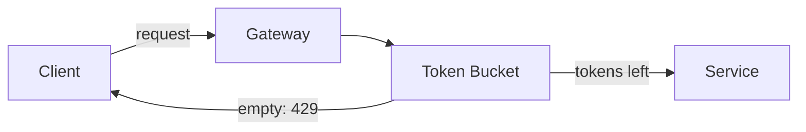

# Road to Senior — Phase 1 Implementation Plan

> **For agentic workers:** REQUIRED SUB-SKILL: Use superpowers:subagent-driven-development (recommended) or superpowers:executing-plans to implement this plan task-by-task. Steps use checkbox (`- [ ]`) syntax for tracking.

**Goal:** Ship a VitePress interview-prep knowledge site (hero + filterable card grid, four content pillars, local search, tags index, Mermaid) live on GitHub Pages at `https://haongo138.github.io/road-to-senior/`.

**Architecture:** Markdown-first VitePress site under `docs/`. A build-time `createContentLoader` reads frontmatter from content pages into a pure, unit-tested data layer (`theme/lib/cards.ts`). Thin Vue components (`CardGrid`, `Card`, `TagFilter`, `TagsPage`) consume that data and filter client-side. GitHub Actions builds on push to `main` and deploys to Pages. Active-recall/flashcards are deferred to Phase 2.

**Tech Stack:** VitePress 1.x, Vue 3, `vitepress-plugin-mermaid` + `mermaid`, Vitest (unit tests for the pure data layer), GitHub Actions + GitHub Pages.

---

## File Structure

```
road-to-senior/
├─ .github/workflows/deploy.yml          # CI build + deploy to Pages
├─ .gitignore
├─ package.json
├─ README.md
└─ docs/
   ├─ index.md                            # home: hero + features + <CardGrid/>
   ├─ tags.md                             # <TagsPage/>
   ├─ system-design/{index.md, rate-limiter.md}
   ├─ technical/{index.md, idempotency.md}
   ├─ behavioral/{index.md, star-method.md}
   ├─ notes/{index.md, welcome.md}
   └─ .vitepress/
      ├─ config.ts                        # site config: nav, sidebar, search, base, mermaid
      ├─ loaders/cards.data.ts            # createContentLoader → CardItem[]
      └─ theme/
         ├─ index.ts                      # extends default theme, registers components
         ├─ custom.css                    # card grid / filter styles
         ├─ lib/
         │  ├─ cards.ts                   # PURE data layer (unit tested)
         │  └─ cards.test.ts              # Vitest unit tests
         └─ components/
            ├─ Card.vue
            ├─ CardGrid.vue
            ├─ TagFilter.vue
            └─ TagsPage.vue
```

**Path note:** `createContentLoader` globs are relative to `srcDir` (`docs/`). Component relative imports: from `theme/components/*.vue` → loader is `../../loaders/cards.data`, lib is `../lib/cards`.

---

## Task 1: Scaffold project + boot dev server

**Files:**
- Create: `package.json`, `.gitignore`, `docs/.vitepress/config.ts`, `docs/index.md`

- [ ] **Step 1: Initialize package and install deps**

Run (installs current versions, generates `package.json` deps + lockfile):

```bash
npm init -y
npm pkg set name="road-to-senior" private=true type="module"
npm pkg set scripts.docs:dev="vitepress dev docs"
npm pkg set scripts.docs:build="vitepress build docs"
npm pkg set scripts.docs:preview="vitepress preview docs"
npm pkg set scripts.test="vitest run"
npm install -D vitepress vue vitepress-plugin-mermaid mermaid vitest
```

- [ ] **Step 2: Create `.gitignore`**

```
node_modules
docs/.vitepress/dist
docs/.vitepress/cache
*.log
.DS_Store
```

- [ ] **Step 3: Create minimal `docs/.vitepress/config.ts`**

```ts
import { withMermaid } from 'vitepress-plugin-mermaid'

export default withMermaid({
  title: 'Road to Senior',
  description: 'Notes & patterns on the way to passing the senior SWE interview',
  base: '/road-to-senior/',
  cleanUrls: true,
  themeConfig: {
    search: { provider: 'local' },
    nav: [
      { text: 'System Design', link: '/system-design/' },
      { text: 'Technical', link: '/technical/' },
      { text: 'Behavioral', link: '/behavioral/' },
      { text: 'Notes', link: '/notes/' },
      { text: 'Tags', link: '/tags' },
    ],
    socialLinks: [
      { icon: 'github', link: 'https://github.com/haongo138/road-to-senior' },
    ],
  },
  mermaid: {},
})
```

- [ ] **Step 4: Create placeholder `docs/index.md`**

```md
# Road to Senior

Scaffold online. Home page comes in Task 5.
```

- [ ] **Step 5: Boot the dev server to verify it runs**

Run: `npm run docs:dev`
Expected: server starts and prints a local URL (e.g. `http://localhost:5173/road-to-senior/`) with no errors. Stop it with Ctrl+C.

- [ ] **Step 6: Verify a production build succeeds**

Run: `npm run docs:build`
Expected: `build complete` with no dead-link or compile errors; output in `docs/.vitepress/dist`.

- [ ] **Step 7: Commit**

```bash
git add package.json package-lock.json .gitignore docs/
git commit -m "chore: scaffold VitePress site with base path and mermaid"
```

---

## Task 2: Pure data layer (`cards.ts`) — TDD

This is the one piece of real logic. Build it test-first.

**Files:**
- Create: `docs/.vitepress/theme/lib/cards.ts`
- Test: `docs/.vitepress/theme/lib/cards.test.ts`

- [ ] **Step 1: Write the failing test**

`docs/.vitepress/theme/lib/cards.test.ts`:

```ts
import { describe, it, expect } from 'vitest'
import { buildCards, filterByCategory, collectTags, type RawPage } from './cards'

const pages: RawPage[] = [
  { url: '/system-design/rate-limiter', frontmatter: { title: 'Rate Limiter', description: 'd', category: 'system-design', tags: ['scaling', 'api'], status: 'solid' } },
  { url: '/technical/idempotency', frontmatter: { title: 'Idempotency', description: 'd', category: 'technical', tags: ['api'], status: 'review' } },
  { url: '/system-design/', frontmatter: { title: 'Overview' } }, // section index: no category → excluded
  { url: '/', frontmatter: { layout: 'home' } },                  // home → excluded
]

describe('buildCards', () => {
  it('keeps only pages with a title and a known category', () => {
    const cards = buildCards(pages)
    expect(cards.map((c) => c.url)).toEqual(['/technical/idempotency', '/system-design/rate-limiter'])
  })

  it('sorts by title and applies frontmatter defaults', () => {
    const cards = buildCards(pages)
    expect(cards[0].title).toBe('Idempotency')
    expect(cards[0].tags).toEqual(['api'])
    expect(cards[1].status).toBe('solid')
  })
})

describe('filterByCategory', () => {
  it('returns all cards for "all"', () => {
    expect(filterByCategory(buildCards(pages), 'all')).toHaveLength(2)
  })
  it('filters to a single category', () => {
    const only = filterByCategory(buildCards(pages), 'technical')
    expect(only.map((c) => c.url)).toEqual(['/technical/idempotency'])
  })
})

describe('collectTags', () => {
  it('counts tags across cards, sorted by count then name', () => {
    expect(collectTags(buildCards(pages))).toEqual([
      { tag: 'api', count: 2 },
      { tag: 'scaling', count: 1 },
    ])
  })
})
```

- [ ] **Step 2: Run the test to verify it fails**

Run: `npm test`
Expected: FAIL — `Cannot find module './cards'` (or export not found).

- [ ] **Step 3: Implement `cards.ts`**

`docs/.vitepress/theme/lib/cards.ts`:

```ts
export interface RawPage {
  url: string
  frontmatter: Record<string, any>
}

export interface CardItem {
  title: string
  description: string
  url: string
  category: string
  tags: string[]
  status: string
}

export const CATEGORIES = ['system-design', 'technical', 'behavioral', 'notes'] as const
type Category = (typeof CATEGORIES)[number]

export function isContentCard(page: RawPage): boolean {
  const fm = page.frontmatter ?? {}
  return Boolean(fm.title) && CATEGORIES.includes(fm.category as Category)
}

export function toCard(page: RawPage): CardItem {
  const fm = page.frontmatter ?? {}
  return {
    title: fm.title,
    description: fm.description ?? '',
    url: page.url,
    category: fm.category,
    tags: Array.isArray(fm.tags) ? fm.tags : [],
    status: fm.status ?? 'draft',
  }
}

export function buildCards(pages: RawPage[]): CardItem[] {
  return pages
    .filter(isContentCard)
    .map(toCard)
    .sort((a, b) => a.title.localeCompare(b.title))
}

export function filterByCategory(cards: CardItem[], category: string): CardItem[] {
  return category === 'all' ? cards : cards.filter((c) => c.category === category)
}

export function collectTags(cards: CardItem[]): { tag: string; count: number }[] {
  const counts = new Map<string, number>()
  for (const card of cards) {
    for (const tag of card.tags) counts.set(tag, (counts.get(tag) ?? 0) + 1)
  }
  return [...counts.entries()]
    .map(([tag, count]) => ({ tag, count }))
    .sort((a, b) => b.count - a.count || a.tag.localeCompare(b.tag))
}
```

- [ ] **Step 4: Run the test to verify it passes**

Run: `npm test`
Expected: PASS — all assertions green.

- [ ] **Step 5: Commit**

```bash
git add docs/.vitepress/theme/lib/
git commit -m "feat: add tested pure data layer for cards and tags"
```

---

## Task 3: Content loader (`cards.data.ts`)

**Files:**
- Create: `docs/.vitepress/loaders/cards.data.ts`

- [ ] **Step 1: Implement the loader**

`docs/.vitepress/loaders/cards.data.ts`:

```ts
import { createContentLoader } from 'vitepress'
import { buildCards, type CardItem, type RawPage } from '../theme/lib/cards'

declare const data: CardItem[]
export { data }

export default createContentLoader('**/*.md', {
  transform(raw): CardItem[] {
    const pages: RawPage[] = raw.map((p) => ({ url: p.url, frontmatter: p.frontmatter }))
    return buildCards(pages)
  },
})
```

- [ ] **Step 2: Verify it type-checks via build**

(The loader only runs inside the VitePress build; it is exercised by Task 5's build. No standalone test here — `buildCards` is already unit-tested in Task 2.) Run: `npm run docs:build`
Expected: build completes with no errors.

- [ ] **Step 3: Commit**

```bash
git add docs/.vitepress/loaders/
git commit -m "feat: add content loader feeding cards from frontmatter"
```

---

## Task 4: Theme components + registration

**Files:**
- Create: `docs/.vitepress/theme/components/Card.vue`, `CardGrid.vue`, `TagFilter.vue`, `TagsPage.vue`
- Create: `docs/.vitepress/theme/index.ts`, `docs/.vitepress/theme/custom.css`

- [ ] **Step 1: Create `Card.vue`**

`docs/.vitepress/theme/components/Card.vue`:

```vue
<script setup lang="ts">
import { withBase } from 'vitepress'
import type { CardItem } from '../lib/cards'
defineProps<{ item: CardItem }>()
</script>

<template>
  <a class="rs-card" :href="withBase(item.url)">
    <span class="rs-card__badge">{{ item.category }}</span>
    <h3 class="rs-card__title">{{ item.title }}</h3>
    <p class="rs-card__desc">{{ item.description }}</p>
    <div class="rs-card__tags">
      <span v-for="t in item.tags" :key="t" class="rs-card__tag">#{{ t }}</span>
    </div>
  </a>
</template>
```

- [ ] **Step 2: Create `TagFilter.vue`**

`docs/.vitepress/theme/components/TagFilter.vue`:

```vue
<script setup lang="ts">
defineProps<{ categories: { key: string; label: string }[]; active: string }>()
defineEmits<{ (e: 'select', key: string): void }>()
</script>

<template>
  <div class="rs-filter">
    <button
      v-for="c in categories"
      :key="c.key"
      class="rs-filter__btn"
      :class="{ 'is-active': c.key === active }"
      @click="$emit('select', c.key)"
    >
      {{ c.label }}
    </button>
  </div>
</template>
```

- [ ] **Step 3: Create `CardGrid.vue`**

`docs/.vitepress/theme/components/CardGrid.vue`:

```vue
<script setup lang="ts">
import { ref, computed } from 'vue'
import { data as cards } from '../../loaders/cards.data'
import { filterByCategory } from '../lib/cards'
import Card from './Card.vue'
import TagFilter from './TagFilter.vue'

const categories = [
  { key: 'all', label: 'All' },
  { key: 'system-design', label: 'System Design' },
  { key: 'technical', label: 'Technical' },
  { key: 'behavioral', label: 'Behavioral' },
  { key: 'notes', label: 'Notes' },
]
const active = ref('all')
const visible = computed(() => filterByCategory(cards, active.value))
</script>

<template>
  <div class="rs-grid-wrap">
    <TagFilter :categories="categories" :active="active" @select="active = $event" />
    <div class="rs-grid">
      <Card v-for="c in visible" :key="c.url" :item="c" />
    </div>
    <p v-if="!visible.length" class="rs-grid__empty">No notes in this category yet.</p>
  </div>
</template>
```

- [ ] **Step 4: Create `TagsPage.vue`**

`docs/.vitepress/theme/components/TagsPage.vue`:

```vue
<script setup lang="ts">
import { withBase } from 'vitepress'
import { data as cards } from '../../loaders/cards.data'
import { collectTags } from '../lib/cards'

const tags = collectTags(cards)
const cardsFor = (tag: string) => cards.filter((c) => c.tags.includes(tag))
</script>

<template>
  <div v-if="tags.length" class="rs-tags">
    <section v-for="{ tag, count } in tags" :key="tag" class="rs-tags__section">
      <h2 :id="tag">#{{ tag }} <small>({{ count }})</small></h2>
      <ul>
        <li v-for="c in cardsFor(tag)" :key="c.url">
          <a :href="withBase(c.url)">{{ c.title }}</a> — <em>{{ c.category }}</em>
        </li>
      </ul>
    </section>
  </div>
  <p v-else>No tags yet — add <code>tags</code> to your note frontmatter.</p>
</template>
```

- [ ] **Step 5: Create `theme/index.ts`**

`docs/.vitepress/theme/index.ts`:

```ts
import DefaultTheme from 'vitepress/theme'
import type { Theme } from 'vitepress'
import CardGrid from './components/CardGrid.vue'
import TagsPage from './components/TagsPage.vue'
import './custom.css'

export default {
  extends: DefaultTheme,
  enhanceApp({ app }) {
    app.component('CardGrid', CardGrid)
    app.component('TagsPage', TagsPage)
  },
} satisfies Theme
```

- [ ] **Step 6: Create `custom.css`**

`docs/.vitepress/theme/custom.css`:

```css
.rs-filter {
  display: flex;
  flex-wrap: wrap;
  gap: 8px;
  margin: 24px 0;
}
.rs-filter__btn {
  border: 1px solid var(--vp-c-divider);
  border-radius: 999px;
  padding: 6px 14px;
  font-size: 13px;
  cursor: pointer;
  background: var(--vp-c-bg-soft);
  color: var(--vp-c-text-2);
  transition: all 0.2s;
}
.rs-filter__btn.is-active {
  background: var(--vp-c-brand-1);
  border-color: var(--vp-c-brand-1);
  color: #fff;
}
.rs-grid {
  display: grid;
  grid-template-columns: repeat(auto-fill, minmax(260px, 1fr));
  gap: 16px;
}
.rs-card {
  display: block;
  border: 1px solid var(--vp-c-divider);
  border-radius: 12px;
  padding: 18px;
  text-decoration: none;
  color: inherit;
  transition: border-color 0.2s, transform 0.2s;
}
.rs-card:hover {
  border-color: var(--vp-c-brand-1);
  transform: translateY(-2px);
}
.rs-card__badge {
  font-size: 11px;
  text-transform: uppercase;
  letter-spacing: 0.04em;
  color: var(--vp-c-brand-1);
}
.rs-card__title {
  margin: 8px 0 4px;
  font-size: 16px;
  font-weight: 600;
  border: none;
  padding: 0;
}
.rs-card__desc {
  margin: 0 0 12px;
  font-size: 14px;
  color: var(--vp-c-text-2);
}
.rs-card__tag {
  font-size: 12px;
  color: var(--vp-c-text-3);
  margin-right: 8px;
}
.rs-grid__empty,
.rs-tags p {
  color: var(--vp-c-text-3);
}
```

- [ ] **Step 7: Verify build still succeeds**

Run: `npm run docs:build`
Expected: build completes; no compile errors from the new components. (Cards may be empty until Task 6 adds content — that is fine.)

- [ ] **Step 8: Commit**

```bash
git add docs/.vitepress/theme/
git commit -m "feat: add card grid, tag filter, and tags-page components"
```

---

## Task 5: Home page (hero + features + card grid)

**Files:**
- Modify: `docs/index.md` (replace placeholder)

- [ ] **Step 1: Replace `docs/index.md`**

```md
---
layout: home
hero:
  name: Road to Senior
  text: Notes & patterns for the senior SWE interview
  tagline: System design, technical patterns, and behavioral prep — one place to think like a senior.
  actions:
    - theme: brand
      text: Start with System Design
      link: /system-design/
    - theme: alt
      text: Browse Tags
      link: /tags
features:
  - icon: 🗺️
    title: System Design Maps
    details: Architecture maps per system — diagrams, trade-offs, and where they break.
  - icon: 🧩
    title: Technical Patterns
    details: Coding, DSA, concurrency, API design, and testing idioms.
  - icon: 🗣️
    title: Behavioral Prep
    details: STAR stories, leadership principles, and prepared answers.
---

## Browse all notes

<CardGrid />
```

- [ ] **Step 2: Verify in dev server**

Run: `npm run docs:dev`, open the printed URL.
Expected: hero + three feature cards render; below them the filter chips and an empty grid (content arrives in Task 6). No console errors. Stop with Ctrl+C.

- [ ] **Step 3: Commit**

```bash
git add docs/index.md
git commit -m "feat: home page with hero, features, and card grid"
```

---

## Task 6: Content pillars — section indexes, seed notes, sidebar

**Files:**
- Create: `docs/system-design/index.md`, `docs/technical/index.md`, `docs/behavioral/index.md`, `docs/notes/index.md`
- Create: `docs/technical/idempotency.md`, `docs/behavioral/star-method.md`, `docs/notes/welcome.md`
- Modify: `docs/.vitepress/config.ts` (add `sidebar`)

(The system-design seed note with a Mermaid diagram is added in Task 7.)

- [ ] **Step 1: Create the four section index pages** (no `category` → excluded from cards)

`docs/system-design/index.md`:

```md
---
title: System Design
---

# System Design

Architecture maps per system: the diagram, the trade-offs, and where it breaks at scale.
```

`docs/technical/index.md`:

```md
---
title: Technical Patterns
---

# Technical Patterns

Coding, data structures & algorithms, concurrency, API design, and testing idioms.
```

`docs/behavioral/index.md`:

```md
---
title: Behavioral
---

# Behavioral

STAR stories, leadership principles, and prepared answers to common questions.
```

`docs/notes/index.md`:

```md
---
title: Notes
---

# Notes

Free-form learnings captured as you study.
```

- [ ] **Step 2: Create seed content notes** (full frontmatter → appear as cards)

`docs/technical/idempotency.md`:

```md
---
title: Idempotency Keys
description: Make unsafe operations safe to retry with client-supplied keys.
tags: [api, reliability]
category: technical
status: solid
---

# Idempotency Keys

Clients send a unique `Idempotency-Key` header. The server records the key with the
result of the first request; retries with the same key return the stored result
instead of re-executing the side effect.

**Where it breaks:** key storage TTL vs. retry windows, and partial writes before the
key is committed. Persist the key and the outcome in the same transaction.
```

`docs/behavioral/star-method.md`:

```md
---
title: STAR Method
description: Structure behavioral answers as Situation, Task, Action, Result.
tags: [behavioral, communication]
category: behavioral
status: review
---

# STAR Method

- **Situation** — set the context briefly.
- **Task** — what you were responsible for.
- **Action** — what *you* did (use "I", not "we").
- **Result** — quantify the outcome.

Keep it under two minutes. Lead with the result if the interviewer is time-boxing.
```

`docs/notes/welcome.md`:

```md
---
title: How I use this site
description: Conventions for adding notes and keeping the card grid useful.
tags: [meta]
category: notes
status: solid
---

# How I use this site

Every note carries frontmatter: `title`, `description`, `tags`, `category`
(`system-design` | `technical` | `behavioral` | `notes`), and `status`
(`draft` | `review` | `solid`). The home grid and `/tags` page build themselves
from that frontmatter — no manual index to maintain.
```

- [ ] **Step 3: Add `sidebar` to `docs/.vitepress/config.ts`**

Add this `sidebar` key inside `themeConfig` (alongside `search`, `nav`, `socialLinks`):

```ts
    sidebar: {
      '/system-design/': [
        {
          text: 'System Design',
          items: [
            { text: 'Overview', link: '/system-design/' },
            { text: 'Rate Limiter', link: '/system-design/rate-limiter' },
          ],
        },
      ],
      '/technical/': [
        {
          text: 'Technical Patterns',
          items: [
            { text: 'Overview', link: '/technical/' },
            { text: 'Idempotency Keys', link: '/technical/idempotency' },
          ],
        },
      ],
      '/behavioral/': [
        {
          text: 'Behavioral',
          items: [
            { text: 'Overview', link: '/behavioral/' },
            { text: 'STAR Method', link: '/behavioral/star-method' },
          ],
        },
      ],
      '/notes/': [
        {
          text: 'Notes',
          items: [
            { text: 'Overview', link: '/notes/' },
            { text: 'How I use this site', link: '/notes/welcome' },
          ],
        },
      ],
    },
```

- [ ] **Step 4: Verify cards + sidebar in dev server**

Run: `npm run docs:dev`
Expected: home grid now shows 3 cards (Idempotency Keys, STAR Method, How I use this site); clicking a filter chip narrows them; each section page shows its sidebar. No console errors.

- [ ] **Step 5: Commit**

```bash
git add docs/system-design/ docs/technical/ docs/behavioral/ docs/notes/ docs/.vitepress/config.ts
git commit -m "feat: add content pillars, seed notes, and sidebar nav"
```

---

## Task 7: System-design seed note with Mermaid

**Files:**
- Create: `docs/system-design/rate-limiter.md`

- [ ] **Step 1: Create the Mermaid-bearing note**

`docs/system-design/rate-limiter.md`:

````md
---
title: Rate Limiter
description: Token-bucket rate limiting at the API gateway, and where it breaks.
tags: [scaling, api]
category: system-design
status: solid
---

# Rate Limiter



**Approach:** each client key maps to a token bucket (capacity + refill rate)
held in a fast store (e.g. Redis). A request consumes one token; an empty bucket
returns `429 Too Many Requests`.

**Trade-offs:** local in-memory buckets are fast but inconsistent across nodes;
a shared store is consistent but adds a network hop per request.

**Where it breaks:** clock skew on refill, hot keys overloading a single shard,
and thundering herds when many buckets refill on the same boundary.
````

- [ ] **Step 2: Verify the diagram renders**

Run: `npm run docs:dev`, open `/system-design/rate-limiter`.
Expected: the Mermaid flowchart renders as SVG (not a code block); the page appears as a 4th card on the home grid under the "System Design" filter.

- [ ] **Step 3: Verify production build (Mermaid + dead-link gate)**

Run: `npm run docs:build`
Expected: build completes with no errors and no dead-link warnings.

- [ ] **Step 4: Commit**

```bash
git add docs/system-design/rate-limiter.md
git commit -m "feat: add rate limiter system-design map with mermaid diagram"
```

---

## Task 8: Tags index page

**Files:**
- Create: `docs/tags.md`

- [ ] **Step 1: Create `docs/tags.md`**

```md
---
title: Tags
---

# Tags

<TagsPage />
```

- [ ] **Step 2: Verify in dev server**

Run: `npm run docs:dev`, open `/tags`.
Expected: tag sections render (`#api (2)`, then others by count), each listing the notes carrying that tag with working links. Search (top bar) also returns these notes by keyword.

- [ ] **Step 3: Commit**

```bash
git add docs/tags.md
git commit -m "feat: add auto-generated tags index page"
```

---

## Task 9: GitHub Actions deploy + README

**Files:**
- Create: `.github/workflows/deploy.yml`, `README.md`

- [ ] **Step 1: Create the deploy workflow**

`.github/workflows/deploy.yml`:

```yaml
name: Deploy VitePress site to Pages

on:
  push:
    branches: [main]
  workflow_dispatch:

permissions:
  contents: read
  pages: write
  id-token: write

concurrency:
  group: pages
  cancel-in-progress: false

jobs:
  build:
    runs-on: ubuntu-latest
    steps:
      - name: Checkout
        uses: actions/checkout@v5
        with:
          fetch-depth: 0
      - name: Setup Node
        uses: actions/setup-node@v6
        with:
          node-version: 24
          cache: npm
      - name: Setup Pages
        uses: actions/configure-pages@v4
      - name: Install dependencies
        run: npm ci
      - name: Run unit tests
        run: npm test
      - name: Build with VitePress
        run: npm run docs:build
      - name: Upload artifact
        uses: actions/upload-pages-artifact@v3
        with:
          path: docs/.vitepress/dist

  deploy:
    environment:
      name: github-pages
      url: ${{ steps.deployment.outputs.page_url }}
    needs: build
    runs-on: ubuntu-latest
    name: Deploy
    steps:
      - name: Deploy to GitHub Pages
        id: deployment
        uses: actions/deploy-pages@v4
```

- [ ] **Step 2: Create `README.md`**

```md
# Road to Senior

My notes & patterns (system design, technical, behavioral) on the way to passing
the senior software engineer interview. Built with [VitePress](https://vitepress.dev),
deployed to GitHub Pages at <https://haongo138.github.io/road-to-senior/>.

## Local development

```bash
npm install
npm run docs:dev      # local preview
npm run docs:build    # production build (dead-link gate)
npm test              # unit tests for the data layer
```

## Adding a note

Create a markdown file under `docs/system-design`, `docs/technical`,
`docs/behavioral`, or `docs/notes` with frontmatter:

```yaml
---
title: My Note
description: One-line summary.
tags: [tag-a, tag-b]
category: technical   # system-design | technical | behavioral | notes
status: draft         # draft | review | solid
---
```

The home card grid and `/tags` page update automatically. Add the note to the
matching `sidebar` group in `docs/.vitepress/config.ts`.

## Deployment

Pushing to `main` triggers `.github/workflows/deploy.yml`, which tests, builds,
and deploys to GitHub Pages. One-time setup: **repo Settings → Pages → Source:
GitHub Actions**.
```

- [ ] **Step 3: Verify the full local gate passes**

Run: `npm test && npm run docs:build`
Expected: tests PASS, build completes — this mirrors what CI runs.

- [ ] **Step 4: Commit**

```bash
git add .github/ README.md
git commit -m "ci: add GitHub Pages deploy workflow and README"
```

---

## Task 10: Publish to GitHub Pages (manual trigger)

> These steps create the remote and push. Per the user's git workflow, run them only when the user is ready to publish.

- [ ] **Step 1: Create the GitHub repo** (skip if it already exists)

Run: `gh repo create haongo138/road-to-senior --public --source=. --remote=origin`
Expected: repo created and `origin` remote added.

- [ ] **Step 2: Push `main`**

```bash
git branch -M main
git push -u origin main
```

- [ ] **Step 3: Enable Pages via GitHub Actions** (one-time, in browser)

In the repo: **Settings → Pages → Build and deployment → Source: GitHub Actions**.

- [ ] **Step 4: Verify the deployment**

Watch: `gh run watch` (or the repo's **Actions** tab).
Expected: the "Deploy VitePress site to Pages" workflow succeeds. Then open
<https://haongo138.github.io/road-to-senior/> and confirm the home page, card
filtering, a Mermaid diagram, search, and `/tags` all work with assets resolving
under the `/road-to-senior/` base path.

---

## Self-Review

- **Spec coverage:**
  - VitePress + base path → Task 1. Hero + filterable card grid → Tasks 4, 5.
  - Four pillars w/ seed content → Tasks 6, 7. System-design map gallery w/ Mermaid → Task 7.
  - Local search → Task 1 (`search: { provider: 'local' }`). Tags wiki → Tasks 4, 8.
  - Frontmatter convention + loader → Tasks 2, 3; documented in `notes/welcome.md` and README.
  - GitHub Actions deploy to `/road-to-senior/` → Tasks 1 (base), 9, 10.
  - Phase 2 (flashcards) explicitly excluded — no tasks here, as intended.
- **Placeholder scan:** none — every code/config step is complete; `docs/index.md` placeholder in Task 1 is intentionally replaced in Task 5.
- **Type consistency:** `RawPage`/`CardItem`/`buildCards`/`filterByCategory`/`collectTags` defined in Task 2 are imported with identical names in Tasks 3 (`cards.data.ts`) and 4 (`CardGrid.vue`, `TagsPage.vue`). Loader `data` import path `../../loaders/cards.data` consistent across components. Category keys (`system-design`/`technical`/`behavioral`/`notes`) consistent across `cards.ts`, `CardGrid.vue`, config sidebar, and seed frontmatter.
```
