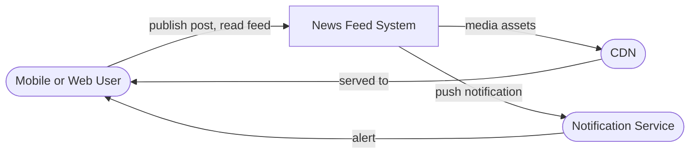
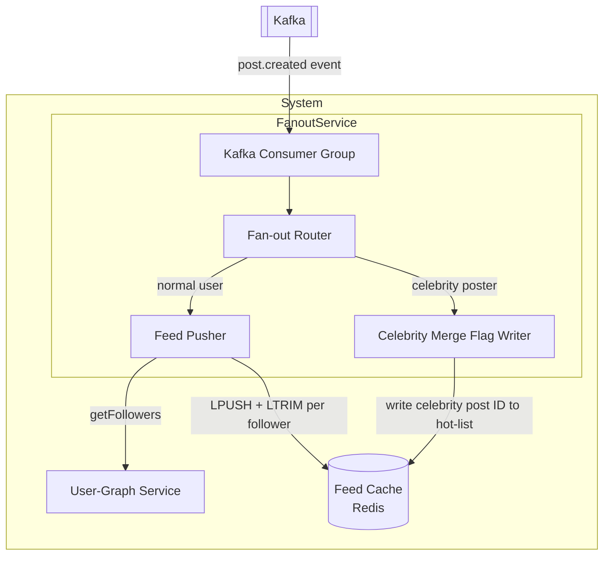

# News Feed

## Overview & use case

- **What it is / who uses it:** A social home timeline — users post content, follow other users, and see a ranked stream of posts from people they follow. Core product surface for Facebook, Twitter/X, Instagram, LinkedIn.
- **Core use cases:** Publish a post; view home timeline; follow/unfollow a user.
- **Functional requirements:** Users can create posts (text, image, video link); users can follow/unfollow others; reading the home feed returns the most recent or ML-ranked posts from all followees, paginated; new posts appear in followers' feeds within a few seconds.
- **Non-functional requirements (scale):** ~500M daily-active users; ~50M posts/day (write side); ~1.5B timeline reads/day (~17K reads/s avg, bursting much higher); read:write heavily read-skewed (~30:1+); timeline load p99 < 200ms; post creation p99 < 500ms; eventual consistency acceptable (a few seconds of feed lag is fine); 99.99% availability.
- **Key constraints / assumptions:** Celebrity accounts can have 50M+ followers — a single post triggers massive fan-out. Inactive users' pre-computed feeds waste storage and compute. Feed can be approximate and eventually consistent. Feed length is capped (e.g. 1,000 post IDs per user); older entries are evicted.

## C1 — System context

> Who/what interacts with the system; the entire News Feed system is one box.



The News Feed System handles both the write path (post creation, fan-out) and the read path (timeline assembly). Media binaries are served via CDN; push alerts are delegated to a separate Notification Service.

## C2 — Containers

> Deployable units and how they communicate.

```mermaid
flowchart LR
  user([User])
  cdn([CDN])

  subgraph System
    api[API Gateway]
    post[Post Service]
    graph[User-Graph Service]
    fanout[Fan-out Service]
    rank[Ranking Service]
    feed[Feed Service]
    q[[Kafka]]
    postdb[(Post Store\nCassandra)]
    graphdb[(Follow Graph\nMySQL)]
    feedcache[(Feed Cache\nRedis)]
    media[(Media Store\nS3)]
  end

  user -->|HTTPS| api
  api --> post
  api --> feed
  post -->|write post| postdb
  post -->|post event| q
  post -->|media upload URL| media
  media -->|served via| cdn
  q --> fanout
  fanout -->|lookup followers| graph
  graph -->|read/write| graphdb
  fanout -->|append post ID| feedcache
  feed -->|read feed| feedcache
  feed -->|hydrate post bodies| postdb
  feed --> rank
```

- **API Gateway** — authenticates requests, rate-limits, routes to Post Service (writes) or Feed Service (reads). Tech: Nginx / Envoy.
- **Post Service** — validates and persists new posts, generates a post ID, uploads media to S3, emits a `post.created` event to Kafka. Tech: Go or Java.
- **User-Graph Service** — owns the follow/unfollow relationship store; exposes `getFollowers(userId, limit, cursor)`. Horizontally sharded by user ID. Tech: MySQL (strong consistency needed for graph mutations) + in-memory cache for hot celebrities.
- **Kafka (message queue)** — decouples post creation from fan-out; absorbs burst writes; fan-out workers consume at their own pace. Each partition maps to a shard of users.
- **Fan-out Service** — async worker pool that reads `post.created` events; fetches the poster's follower list from User-Graph Service; appends the post ID to each follower's feed list in Redis. Skips inactive users. For celebrities, writes only a tombstone and defers to read-time merge (hybrid model — see Trade-offs). Tech: Java workers, auto-scaled.
- **Feed Cache (Redis)** — per-user sorted set of post IDs, scored by timestamp. Capped at ~1,000 entries (LTRIM). Delivers sub-millisecond list access at read time. Tech: Redis Cluster.
- **Post Store (Cassandra)** — append-optimized wide-column store for post bodies, images URLs, metadata. Sharded by `post_id`. Read by Feed Service to hydrate IDs into full posts.
- **Ranking Service** — optional ML re-ranking of the candidate post list before response; operates on already-fetched post metadata to avoid extra DB round-trips. Can be skipped for chronological feeds.
- **Feed Service** — serves the timeline; reads post IDs from Redis, bulk-fetches post bodies from Cassandra (or its local cache), passes through Ranking Service, returns paginated JSON. Tech: Go, horizontally scaled.

## C3 — Components inside the Fan-out Service

> Internal components of the most interesting container.



- **Kafka Consumer Group** — each partition is consumed by one worker; horizontal scaling by adding consumers up to partition count.
- **Fan-out Router** — inspects follower count of the poster (cached). If below threshold (e.g. 10,000 followers) → push path; otherwise → celebrity path.
- **Feed Pusher** — pages through follower list in batches (e.g. 1,000); for each batch, pipelines Redis `LPUSH`/`LTRIM` commands. Rate-limited to avoid Redis hotspot.
- **Celebrity Merge Flag Writer** — writes the celebrity post ID to a shared `celebrity:posts` sorted set. Feed Service merges this set at read time.

## Dynamic — write path and read path

### Write path (fan-out on write — normal user)

1. **User** POSTs to `/post` via API Gateway.
2. **Post Service** validates, writes post body to **Cassandra** (generates `post_id`), uploads media to S3, emits `{post_id, author_id, timestamp}` to **Kafka**.
3. **Fan-out Router** picks up the event; follower count < threshold → **Feed Pusher** path.
4. **Feed Pusher** calls `getFollowers(author_id)` in paginated batches from **User-Graph Service**.
5. For each follower, it executes `LPUSH feed:{follower_id} {post_id}` + `LTRIM feed:{follower_id} 0 999` in **Redis** (pipeline, ~1ms per batch of 100).
6. Followers' feeds are updated within seconds. No read-time work needed.

### Write path (celebrity post — fan-out on read)

Steps 1–3 same. Follower count ≥ threshold → **Celebrity Merge Flag Writer** path.

4. Writer appends `post_id` to `celebrity_posts:{author_id}` sorted set in Redis (tiny write regardless of follower count).
5. No per-follower writes happen. Fan-out cost: O(1) instead of O(50M).

### Read path (timeline assembly)

1. **User** GETs `/feed` via API Gateway → **Feed Service**.
2. Feed Service reads `feed:{user_id}` sorted set from **Redis** (fast, sub-ms). This contains post IDs from normal followees only.
3. Feed Service fetches the user's followed celebrity list from **User-Graph Service** (small, cached).
4. For each celebrity followee, it reads `celebrity_posts:{celebrity_id}` from Redis, takes the top N recent IDs.
5. Merge and deduplicate normal + celebrity post IDs by timestamp.
6. Bulk-fetch post bodies from **Cassandra** (multi-get by `post_id`, L2-cached).
7. Optionally pass to **Ranking Service** for ML re-ranking.
8. Return paginated response to user. Total latency target: p99 < 200ms.

## Trade-offs & where it breaks

### Fan-out on write (push) vs fan-out on read (pull) vs hybrid

| Strategy | Write cost | Read cost | Problem |
|---|---|---|---|
| Push (precompute) | O(followers) per post | O(1) — feed ready in Redis | Amplified writes; 50M-follower celebrity post → 50M Redis writes |
| Pull (assemble at read) | O(1) | O(followees) per read | Slow reads; users following 5,000 accounts need 5,000 lookups |
| **Hybrid** | O(normal followers) | O(celebrity count) | Best of both; standard industry answer |

**Hybrid is the correct answer** because it eliminates the hot-key celebrity write amplification problem while keeping read-path work bounded and fast. The threshold (e.g. 10K followers) is tunable.

### Feed staleness vs cost

Pre-computing feeds for inactive users wastes storage and Redis memory. Mitigation: skip fan-out for users inactive > 30 days; on their next login, reconstruct feed on-demand via pull path.

### Chronological vs ML-ranked feed

Chronological feed: cheap — just sort by score (timestamp) in Redis. ML-ranked feed: requires fetching a larger candidate set (e.g. 500 IDs), hydrating all bodies, scoring each post (engagement signals, recency, affinity). Adds ~50–100ms to read path; mitigated by pre-ranking in a background job and storing a ranked list per user.

### Storage — post IDs not bodies in feed cache

Feed cache stores only `post_id` (8 bytes), not full post bodies. A 1,000-entry feed = ~8KB per user. At 500M users: ~4TB Redis — manageable with Redis Cluster. Post bodies live in Cassandra and are fetched on demand with an L2 in-process cache.

### Thundering herd on viral post

A viral post gets read-amplified when millions of users refresh their feed simultaneously. Mitigations: read-through cache for post bodies with short TTL (10s); request coalescing in Feed Service; circuit breaker on Cassandra.

### Consistency

Feed updates are eventually consistent by design. A post may take 5–30 seconds to appear in all followers' feeds depending on fan-out queue depth. This is acceptable for social feeds (Twitter/X operates at similar lag). Strong consistency would require synchronous fan-out, increasing write latency unacceptably.

### Scale limits

- Redis feed cache memory: shard by `user_id % N`, add shards as user base grows.
- Kafka throughput: partition count scales horizontally; target ~50K events/s per partition is safe.
- Cassandra post store: wide-column, append-only, naturally scales horizontally to petabytes.
- Fan-out worker pool: auto-scale based on Kafka consumer lag; burst capacity for viral events.
- User-Graph Service: read replicas for follower-list lookups; graph mutations go to primary.
