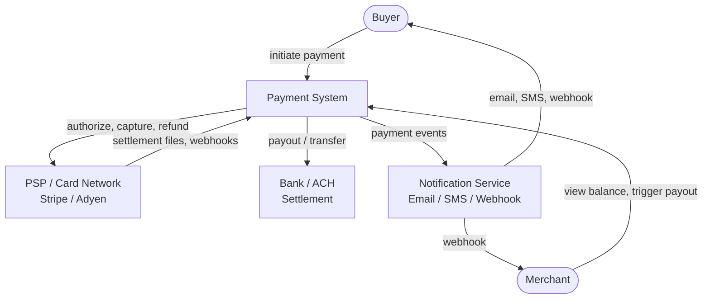
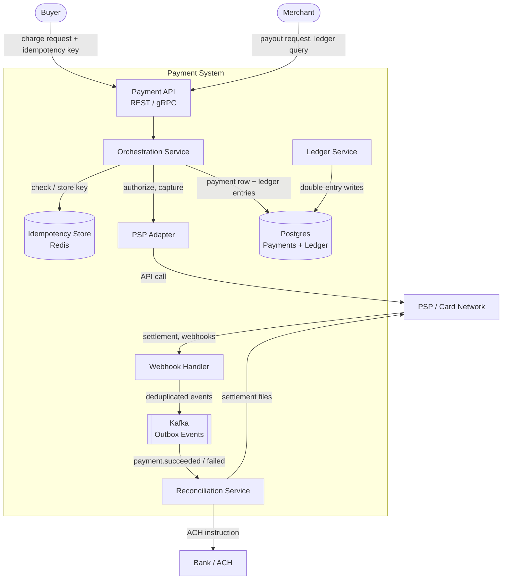
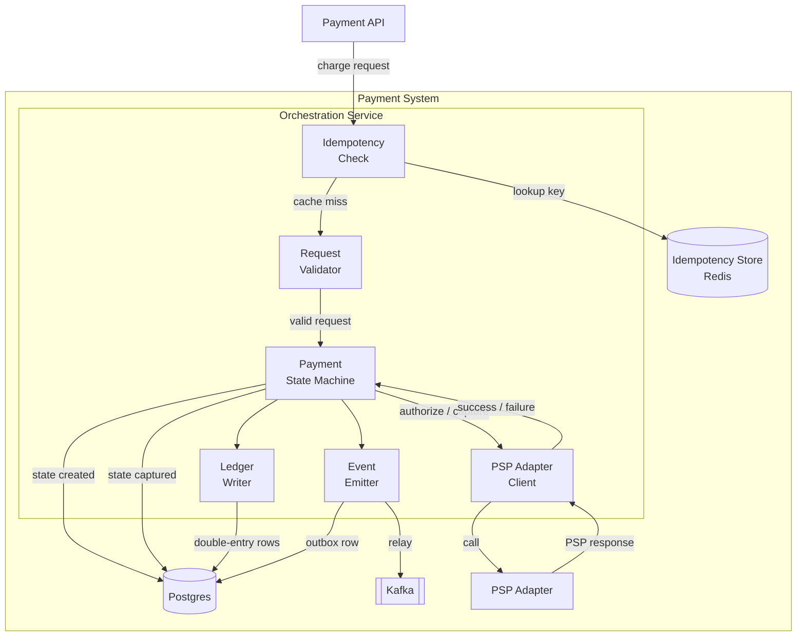

# Payment System

## Overview & use case

- **What it is / who uses it:** A payment platform that moves money on behalf of users and merchants — think Stripe, PayPal, or the billing service inside any e-commerce product. Used by buyers making purchases, merchants accepting charges, and platforms triggering payouts.
- **Core use cases:** Charge / capture (authorize card, capture funds); refund (partial or full, back to original payment method); payout / transfer (move settled funds to a merchant bank account); view ledger / balance (full audit history of every debit and credit).
- **Functional requirements:** Accept a payment request with an idempotency key; authorize and capture via a PSP (Stripe, Adyen, etc.); refund a prior charge; transfer settled balances to external bank accounts; expose a paginated ledger per account; emit real-time webhooks on state transitions.
- **Non-functional requirements (scale):** Correctness is the primary NFR — no double charge, no lost money, no phantom credits. Full auditability: every money movement must be traceable. Idempotency: retrying any operation produces the same outcome. Moderate throughput (thousands of TPS at peaks); strict financial-grade durability (no data loss); reconciliation within 24 hours of PSP settlement.
- **Key constraints / assumptions:** Money is involved — strong consistency and a complete audit trail take priority over raw throughput or availability. PCI DSS compliance: never store raw Primary Account Numbers (PANs); tokenize via PSP vaulting. External PSP calls are unreliable: timeouts leave state UNKNOWN and must be reconciled, never assumed succeeded or failed.

## C1 — System context

> The entire Payment System is one box; this shows who and what it talks to.

The Payment System owns the full lifecycle of a money movement. The PSP / Card Network is the external authority for card authorization and settlement. The bank is used for ACH payouts to merchant accounts. Notification Service dispatches alerts and merchant webhooks.

## C2 — Containers

> Deployable units inside the Payment System and how they communicate.

- **Payment API** — authenticates callers (API key / OAuth), validates request shape, rate-limits, and routes to the Orchestration Service. Stateless; horizontally scaled behind a load balancer.
- **Orchestration Service** — the brain. Enforces idempotency, drives the payment state machine, calls the PSP Adapter, instructs the Ledger Service, and emits outbox events. Single responsibility: coordinate without storing business state in memory.
- **Idempotency Store (Redis)** — maps `(caller_id, idempotency_key)` → prior response. Short TTL (24–48 h). Checked before any mutating operation; see [idempotency](../technical/concepts/idempotency).
- **PSP Adapter** — thin anti-corruption layer over Stripe / Adyen / etc. Translates internal requests to PSP API calls and normalizes responses. Isolates the core from PSP-specific quirks.
- **Ledger Service** — owns double-entry accounting: every charge produces a debit on the buyer's account and a credit on the platform account; every payout produces the reverse. Entries are immutable and append-only. See [transactions and isolation](../technical/concepts/transactions-isolation).
- **Postgres** — single strongly-consistent relational DB. Holds `payments` (state machine rows) and `ledger_entries` (immutable double-entry rows). ACID transactions ensure the ledger and payment state update atomically, plus an `outbox` table for the [Outbox pattern](../technical/concepts/outbox).
- **Kafka (Outbox Events)** — the Outbox worker polls the `outbox` table and publishes `payment.succeeded`, `payment.failed`, `refund.created`, etc. Decouples downstream consumers (reconciliation, notifications) from the synchronous charge path.
- **Reconciliation Service** — async; consumes settlement files and webhooks from the PSP, matches them against internal payment rows, flags discrepancies, and triggers corrective actions. Handles UNKNOWN-state payments left by PSP timeouts.
- **Webhook Handler** — receives inbound PSP webhooks (settlement, chargeback); deduplicates by PSP event ID; publishes normalized events to Kafka for downstream processing.

## C3 — Components inside the Orchestration Service

> Zoom into the most critical container.

- **Idempotency Check** — first gate. Looks up the key in Redis; if found, returns the cached response immediately without touching any other component.
- **Request Validator** — validates amount (positive, within limits), currency code, token (not raw PAN), and presence of idempotency key. Fails fast with a 4xx.
- **Payment State Machine** — owns state transitions: `created → authorized → captured → settled` on the happy path; `failed` and `refunded` on alternates. Persists each transition to Postgres before calling out to the PSP, ensuring the current state is always recoverable. Transitions are guarded (e.g., cannot capture an already-captured payment).
- **PSP Adapter Client** — sends the authorize/capture call; enforces a timeout; maps the result to `SUCCESS`, `FAILURE`, or `UNKNOWN` (timeout / network error). Never retries a capture blindly on `UNKNOWN`.
- **Ledger Writer** — called by the state machine after a successful capture. Writes a balanced pair of `ledger_entries` rows (debit + credit) in the same DB transaction as the state update. Double-entry guarantees the books are always balanced.
- **Event Emitter** — inserts a row into the `outbox` table in the same transaction as the state update and ledger write. The Outbox worker later relays it to Kafka, ensuring at-least-once delivery without dual-write risk.

## Dynamic — charge flow

> End-to-end happy path with idempotency and the external PSP call.

1. **Client** sends `POST /charges` with `{ token, amount, currency, idempotency_key }`.
2. **Payment API** authenticates the caller, validates the schema, forwards to **Orchestration Service**.
3. **Idempotency Check** queries Redis for `(caller_id, idempotency_key)`. If found → return the prior response immediately (no further processing). Cache miss → continue.
4. **Request Validator** checks amount > 0, valid currency, token is a PSP vault token (never a raw PAN). Rejects invalid requests with 422.
5. **Payment State Machine** opens a Postgres transaction: inserts a `payments` row with `state = created`, stores the idempotency key → commit. This anchors the request durably before any external call.
6. **PSP Adapter Client** calls `stripe.charges.create(...)` (or equivalent). Sets a strict timeout (e.g. 10 s).
   - **Success** → PSP returns `authorized/captured` charge ID.
   - **Failure** → PSP returns a decline code → state machine transitions to `failed` → ledger write skipped.
   - **Timeout / network error** → result is `UNKNOWN`. State machine sets `state = unknown`. **Do NOT assume success or retry the capture.** Hand off to Reconciliation Service.
7. On **success**: state machine opens a new Postgres transaction:
   - Update `payments.state = captured`.
   - **Ledger Writer** inserts two `ledger_entries` rows (debit buyer, credit platform) in the same transaction — a balanced double-entry. The books cannot drift.
   - **Event Emitter** inserts `{ event: payment.succeeded, payment_id }` into the `outbox` table — same transaction.
   - Commit. All three writes are atomic; partial failure is impossible.
8. **Outbox worker** (outside this transaction) polls the `outbox` table, publishes `payment.succeeded` to Kafka. Downstream services (notifications, reconciliation) consume idempotently.
9. **Orchestration Service** stores the final response in Redis under the idempotency key (TTL 48 h), returns `200 OK` to the client.
10. **Reconciliation Service** (async, daily + on-demand) compares internal `payments` rows against PSP settlement files; resolves any `unknown`-state payments; raises alerts for gaps.

## Trade-offs & where it breaks

- **Idempotency keys prevent double charges on retries.** Clients must generate a stable key per logical operation. Without this, a client timeout + retry creates two charges. Store the key → response mapping durably (Redis with TTL, or in Postgres as a fallback). See [idempotency](../technical/concepts/idempotency).

- **Double-entry ledger vs mutable balance column.** A mutable `balance` column is simple but loses history and is vulnerable to race conditions (concurrent updates). An immutable, append-only ledger of debit/credit pairs is always auditable, always balanced, and can be summed to produce the current balance at any point in time. Correctness and auditability win over simplicity.

- **Strong consistency traded against availability.** Payments use a single-region Postgres primary with ACID transactions. This means a primary failure causes brief unavailability rather than split-brain money corruption. CP over AP — money favors consistency. Geo-redundancy is added via read replicas and standby promotion, not eventual consistency.

- **The dual-write problem.** After the PSP call succeeds, you must update your DB and publish an event. If you write to the DB and then crash before publishing, the event is lost. Solution: [Outbox pattern](../technical/concepts/outbox) — write the event as a row in the same DB transaction as the state update, then relay it to Kafka asynchronously. At-least-once delivery from the outbox + idempotent consumers = effectively exactly-once semantics.

- **Exactly-once is not a primitive; it is achieved.** The correct model is: at-least-once delivery + idempotent consumers + reconciliation. Never assume a message broker gives you exactly-once. Each consumer deduplicates by event ID before acting.

- **PSP timeout → UNKNOWN state, not assumed success.** If the PSP call times out, you do not know whether the charge was created. Silently retrying a capture risks a double charge. Silently failing risks losing a legitimate payment. Correct behavior: record `state = unknown`, let Reconciliation Service query the PSP for the true outcome, then transition to `captured` or `failed` accordingly.

- **PCI compliance — tokenize, never store raw PAN.** Card numbers must never touch your database. Collect card data client-side via PSP JS SDK (Stripe.js, etc.), exchange for a vault token at the PSP, and pass only the token to your backend. This scopes PCI audit surface to the PSP.

- **Where it breaks:**
  - *Partial failure between DB and PSP* — state machine writes `created` then PSP call fails mid-flight; the `created` row is orphaned. Reconciliation must time-out and expire these rows.
  - *Duplicate / out-of-order PSP webhooks* — webhook handler must deduplicate by PSP event ID (store in Postgres with a unique index) and handle events arriving out of order (ignore a `charge.captured` webhook if the payment is already `settled`).
  - *Reconciliation gaps* — PSP settlement files arrive with a 1–2 day delay; your ledger may show funds that have not yet settled. Clearly distinguish `captured` (PSP acknowledged) from `settled` (funds received) in the state machine.
  - *Redis idempotency store eviction* — if Redis evicts a key before the client's retry window, a retry is treated as a new request. Mitigation: use a sufficiently long TTL, and back up idempotency keys to Postgres for high-value flows.
