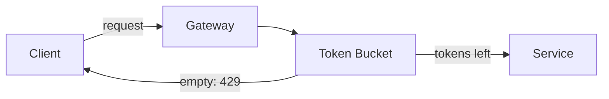

# Rate Limiter

**Approach:** each client key maps to a token bucket (capacity + refill rate)
held in a fast store (e.g. Redis). A request consumes one token; an empty bucket
returns `429 Too Many Requests`.

**Trade-offs:** local in-memory buckets are fast but inconsistent across nodes;
a shared store is consistent but adds a network hop per request.

**Where it breaks:** clock skew on refill, hot keys overloading a single shard,
and thundering herds when many buckets refill on the same boundary.
