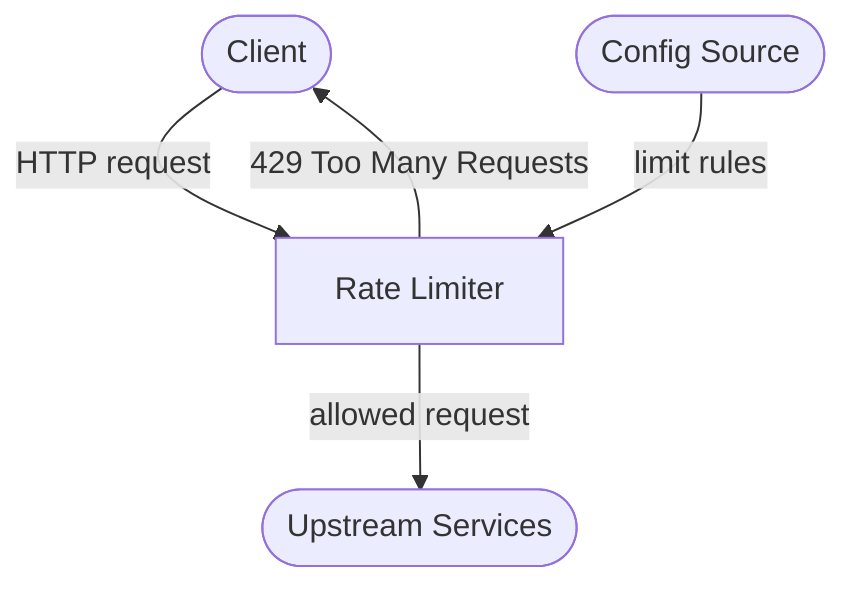
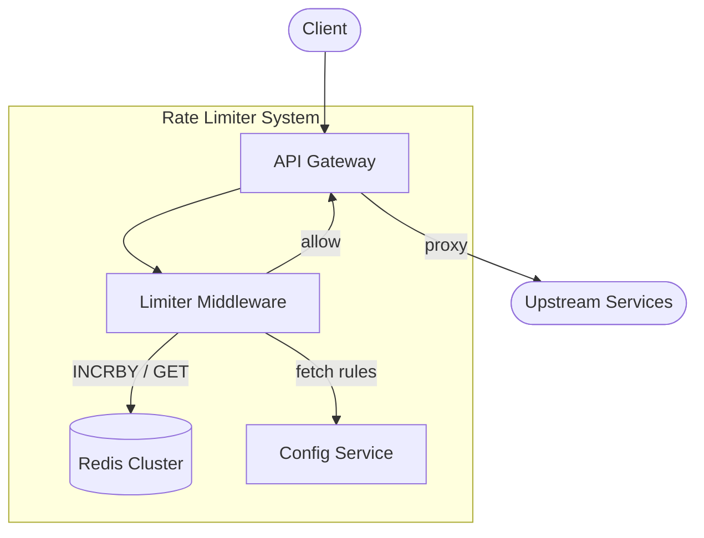
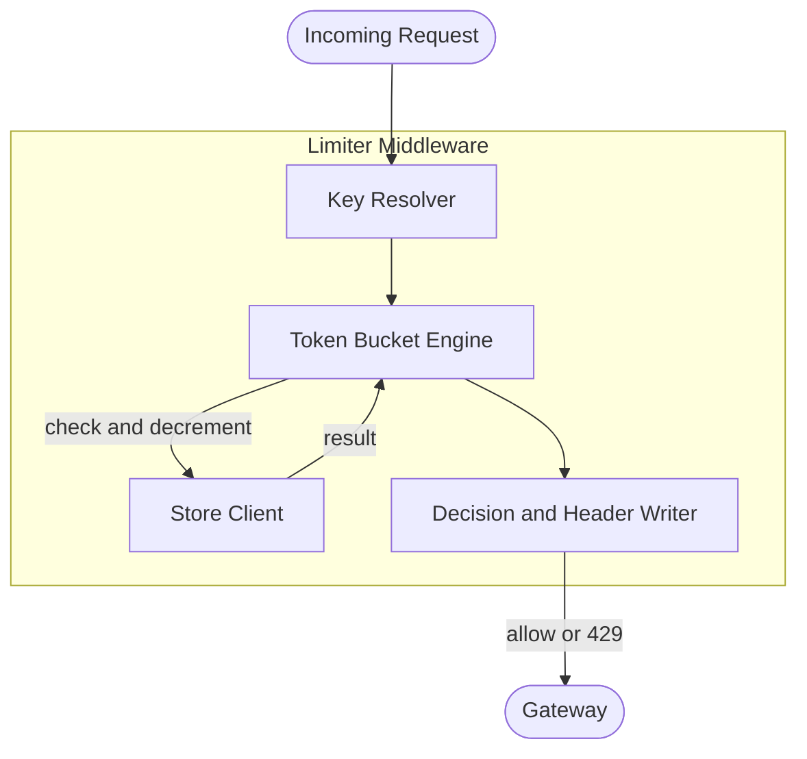

# Rate Limiter

## Overview & use case

- **What it is / who uses it:** A layer inserted at the API gateway that enforces per-client (or per-key, per-IP) request quotas. Used by every public API platform (Stripe, GitHub, Twilio) to protect upstream services from overload and abuse.
- **Core use cases:** Per-client throughput caps; burst allowances; tiered plans (free vs paid limits); DDoS mitigation.
- **Functional requirements:** Configurable limits per key/tier; enforce limit and return `429 Too Many Requests` with `Retry-After`; attach `X-RateLimit-*` headers on every response; support multiple windows (per-second, per-minute, per-day).
- **Non-functional requirements (scale):** ~100k req/s at the gateway; millions of active keys; added latency budget ≤1ms p99; 99.99% availability; write-heavy on counter updates (roughly 1 write per request).
- **Key constraints / assumptions:** Distributed across many gateway nodes; shared state required for correctness; must handle Redis unavailability gracefully (fail-open or fail-closed, a product decision).

## C1 — System context

> Clients hit the Rate Limiter sitting at the API gateway; allowed traffic flows through to upstream services; limit configuration is managed externally.

The Rate Limiter is the sole choke-point between external clients and internal services. The Config Source (a database or control-plane API) holds the per-key and per-tier limit definitions and is read at startup or on a push/poll interval.

## C2 — Containers

> The deployable units inside the Rate Limiter system and how they communicate.

- **API Gateway** — NGINX/Envoy/custom reverse proxy. Receives raw traffic and delegates the rate-limit decision to the middleware before forwarding.
- **Limiter Middleware** — Runs in-process with the gateway or as a sidecar. Contains the algorithm and coordinates with Redis.
- **Redis Cluster** — Shared, low-latency counter/bucket store. Chosen for its atomic increment commands (`INCR`, `SET NX`, Lua scripts) and sub-millisecond reads.
- **Config Service** — Stores limit definitions (key → limit, window, tier). Can be a simple REST API backed by Postgres with an in-memory cache TTL.

## C3 — Components

> Components inside the Limiter Middleware and their responsibilities.

- **Key Resolver** — Extracts the limit key from the request (API key header, IP, user ID). Normalises and hashes it to a Redis key.
- **Token Bucket Engine** — Implements the chosen algorithm (default: token bucket). Computes remaining tokens and whether the request is allowed.
- **Store Client** — Wraps Redis calls. Uses a Lua script for atomic check-and-decrement to avoid TOCTOU races.
- **Decision and Header Writer** — Attaches `X-RateLimit-Limit`, `X-RateLimit-Remaining`, `X-RateLimit-Reset`, and `Retry-After` headers; returns `429` or passes the request forward.

## Dynamic — Request flow

> A single request arrives; the middleware decides allow or reject.

1. **Client** sends `GET /api/resource` with `Authorization: Bearer <key>`.
2. **Key Resolver** extracts and hashes the API key → `ratelimit:key:<hash>:minute`.
3. **Store Client** executes an atomic Lua script on Redis: reads current bucket tokens, refills based on elapsed time, decrements by 1, returns remaining count and whether the bucket was empty.
4. If tokens remain: **Decision Writer** sets `X-RateLimit-Remaining: N`, forwards request to upstream, returns upstream response.
5. If bucket empty: **Decision Writer** returns `429 Too Many Requests` with `Retry-After: <seconds>`, logs the rejection, increments an abuse counter.

## Trade-offs & where it breaks

**Algorithm choice**

| Algorithm | Accuracy | Memory | Burst behaviour |
|-----------|----------|--------|-----------------|
| Token bucket | High (smooth) | O(1) per key | Allows short bursts up to capacity |
| Sliding-window log | Exact | O(requests) per key | No spikes; expensive at scale |
| Fixed-window counter | Low (boundary spikes) | O(1) per key | 2× burst at window boundary |

Token bucket is the industry default: it allows natural bursts, uses constant memory, and is easy to reason about. Sliding-window log is more accurate but memory-prohibitive at millions of keys. Fixed-window is simplest to implement but suffers thundering-herd spikes at every boundary.

**Local vs shared store**

Local in-memory buckets cost zero network hops (< 100µs overhead) but each gateway node tracks independently — a client can exceed the limit by a factor equal to the node count. A shared Redis store gives cross-node consistency at the cost of one network round-trip (~0.5–1ms), which is often within the 1ms budget. Hybrid approaches (local pre-check + periodic Redis sync) reduce Redis pressure but permit small over-admission.

**Bottlenecks at scale**

- **Hot keys** — A single celebrity API key can hammer one Redis shard. Solution: key-based consistent hashing, or shard at the key-prefix level.
- **Single Redis shard overload** — Use Redis Cluster with enough shards; monitor ops/s per slot.
- **Clock skew** — Refill calculations rely on wall-clock time; nodes with skewed clocks over- or under-refill. Use `TIME` command on Redis (server-side time) for the authoritative timestamp.

**Failure modes**

- **Redis down** — *Fail-open*: pass all traffic (risk: overload upstream). *Fail-closed*: reject all traffic (risk: outage). Most APIs choose fail-open with aggressive alerting. A local fallback bucket per node can soften both extremes.
- **Retry storms** — When many clients hit `429` simultaneously and all retry after `Retry-After`, they create a new spike. Add jitter to `Retry-After` or use exponential back-off guidance in the response.
- **Thundering herd at window reset** — Fixed-window counters reset atomically; every blocked client retries at `t=0` of the new window. Token bucket smooths this by refilling continuously.

**Observability signals to monitor:** `rate_limit_rejected_total` by key/tier, Redis op latency p99, bucket fill ratio distribution, Redis replication lag.
