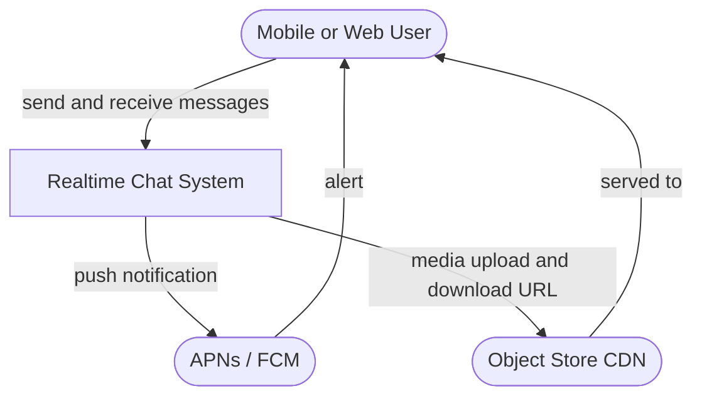
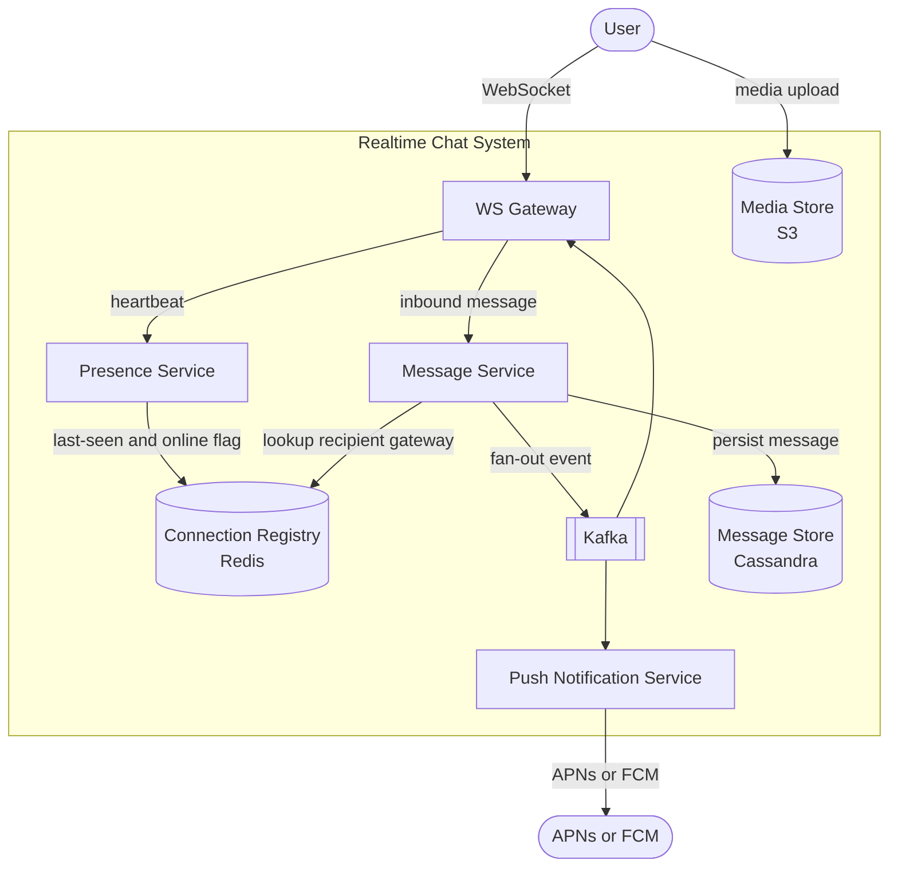
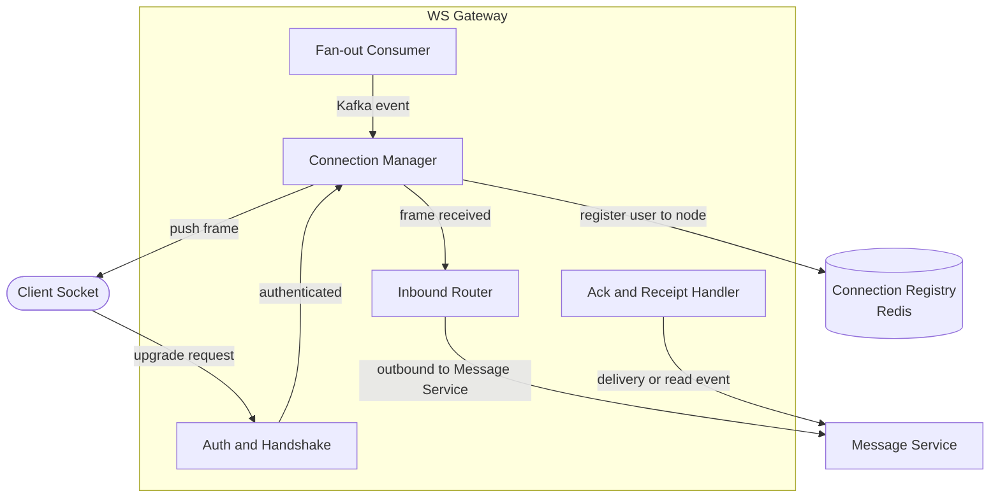

# Realtime Chat

## Overview & use case

- **What it is / who uses it:** A realtime messaging platform where users exchange text, media, and reactions in 1:1 and group conversations. Core product surface for WhatsApp, Slack, Messenger, Discord, and iMessage-scale systems.
- **Core use cases:** 1:1 messaging; group conversations (up to thousands of members); online presence and typing indicators; delivery and read receipts; message history; offline delivery via push notification; media sharing.
- **Functional requirements:** Send and receive messages in real time; create and manage group conversations; see presence (online/offline/last-seen); receive delivery and read receipts; load message history (paginated); receive push notifications when offline; share images and files.
- **Non-functional requirements (scale):** ~500M daily-active users; tens of millions of concurrent WebSocket connections; message delivery p99 < 200ms end-to-end; per-conversation message ordering guaranteed; at-least-once delivery with client-side deduplication; offline storage retained for 30 days; 99.99% availability; message store scales to petabytes.
- **Key constraints / assumptions:** WebSocket connections are stateful — a given user's live connection is pinned to a specific gateway node. Routing messages to the right node is the core coordination problem. Group fan-out is the hot path: a message in a 10,000-member channel triggers 10,000 pushes. Presence heartbeats add sustained write load. Large groups and reconnect storms after deploys are the primary scale cliffs.

## C1 — System context

> The entire Realtime Chat system as one box; actors and external systems only.

The Realtime Chat System owns connection management, message routing, persistence, and presence. Media binaries (images, files) are stored in an object store and served via CDN — the system only stores references. Offline push alerts are delegated to APNs (Apple) and FCM (Google).

## C2 — Containers

> Deployable units inside the Realtime Chat System.

- **WS Gateway** — holds millions of persistent WebSocket connections; one node per logical cluster region. Stateful: a user's live socket lives on exactly one gateway instance. Receives inbound messages, forwards delivery acks, and consumes fan-out events from Kafka to push frames down open sockets. Tech: Netty (Java) or custom Go server; ~1M connections per node with tuned kernel params.
- **Message Service** — stateless; receives inbound messages from the gateway, assigns a per-conversation monotonic sequence number (for ordering), persists to Cassandra, looks up the recipient's gateway node in the Connection Registry, and emits a fan-out event to Kafka. Tech: Go or Java, horizontally scaled.
- **Presence Service** — tracks online/offline status and typing indicators. Receives heartbeats from gateways (every 30s per connected user); writes last-seen timestamps to Redis with TTL. Exposes `getPresence(userIds[])`. Tech: Go; stateless workers backed by Redis.
- **Connection Registry (Redis)** — maps `user_id → gateway_node_id` for every live connection. Written when a socket opens or closes; read by Message Service on every send. Enables O(1) routing without broadcast. Tech: Redis Cluster.
- **Kafka** — decouples inbound message processing from fan-out delivery. Partitioned by `conversation_id` to preserve ordering within a conversation. Consumers: the target gateway node (online push) and Push Notification Service (offline). Retains messages long enough to survive a gateway restart.
- **Message Store (Cassandra)** — wide-column store; primary key `(conversation_id, sequence_number)` ensures per-conversation ordering and efficient range scans for history. Append-only write pattern. Sharded by `conversation_id`. Tech: Cassandra or ScyllaDB.
- **Push Notification Service** — consumes Kafka events for messages whose recipient has no live WebSocket; calls APNs or FCM. Idempotent: includes `message_id` so duplicate pushes are harmless. Tech: Go workers.
- **Media Store (S3)** — object store for images and files. Chat service issues pre-signed upload/download URLs; media never transits through the message path.

## C3 — Components inside the WS Gateway

> Internal components of the connection gateway, the most complex container.

- **Auth and Handshake** — validates the JWT or session token on the HTTP upgrade request before the WebSocket is opened. Rejects unauthenticated connections before any state is allocated.
- **Connection Manager** — owns the in-memory map of `user_id → socket handle` for this node. Registers the connection in Redis on open; deregisters on close or timeout. Dispatches inbound frames to Inbound Router and outbound frames from Fan-out Consumer to the right socket.
- **Inbound Router** — classifies incoming frames: chat messages go to Message Service; typing indicators go to Presence Service; ack frames go to Ack Handler. Keeps the gateway thin and stateless in business logic.
- **Fan-out Consumer** — Kafka consumer group member for this gateway's partition set. Receives events for users whose connection lives on this node; calls Connection Manager to push the frame. If the socket has closed between Kafka enqueue and consumption, it does nothing (Message Service will route to push instead).
- **Ack and Receipt Handler** — processes delivery acks (client received the frame) and read receipts (user opened the conversation); forwards lightweight events to Message Service to update receipt state in Cassandra and fan back to the sender.

## Dynamic — send a message

> End-to-end flow for Alice sending a message to Bob.

1. **Alice's client** sends a `message` frame over her WebSocket to **WS Gateway A** (the node holding her connection).
2. **Inbound Router** on Gateway A forwards the payload to **Message Service**.
3. **Message Service** validates and deduplicates (checks `client_message_id`); assigns the next per-conversation `sequence_number` (via an atomic counter in Redis or a Cassandra LWT); persists the message row to **Cassandra**.
4. Message Service looks up `bob → gateway_node_id` in the **Connection Registry (Redis)**.
5. **If Bob is online** (registry hit): Message Service emits a fan-out event to the **Kafka** topic partition for Bob's gateway node (Gateway B). Fan-out Consumer on Gateway B pops the event and pushes the frame down Bob's socket. Bob's client sends a delivery ack → Ack Handler → Message Service updates `delivered_at` in Cassandra → fans receipt back to Alice.
6. **If Bob is offline** (no registry entry): Message Service emits the event; the **Push Notification Service** Kafka consumer picks it up and sends an APNs/FCM push. When Bob reconnects, his client fetches missed messages via the history API using the last-seen `sequence_number`.
7. **Alice's client** receives a server-side ack confirming persistence (not delivery); UI shows single-tick. Delivery ack (double-tick) arrives when step 5 completes.

## Trade-offs & where it breaks

**WebSocket vs long-polling / SSE**
WebSocket is the right choice for chat: full-duplex, low overhead after handshake, and required for sub-200ms interactive latency. The cost is statefulness — gateway nodes are not interchangeable; sticky routing is mandatory. Long-polling wastes connections and adds latency. SSE is server-push-only; cannot carry client frames.

**Finding the recipient's connection — registry vs pub/sub broadcast**
The Connection Registry (Redis `user_id → node`) gives O(1) targeted routing: Message Service talks only to the one gateway that holds the socket. The alternative — pub/sub broadcast to all gateways — is simpler but wastes CPU on every node for every message. At tens of millions of connections the registry approach is required; the cost is that Redis becomes a coordination bottleneck and must be replicated.

**Per-conversation ordering via sequence numbers**
A global sequence number would require a single writer and would not scale. Assigning sequence numbers per `conversation_id` (using a Redis INCR or Cassandra LWT scoped to that key) provides strong ordering within a conversation at the cost of one extra coordination step per send. Clients sort by `sequence_number`; gaps trigger a history fetch.

**Group fan-out — the hot case**
A message in a 5,000-member group requires 5,000 gateway pushes. These are mediated through Kafka partitions (parallel consumers) and are bounded by the number of distinct gateway nodes those members are connected to. Large groups are the primary latency amplifier; mitigation: cap group size, batch acks, and use separate Kafka topics for large groups with higher parallelism.

**Delivery semantics — at-least-once + client dedup**
Exactly-once delivery across a distributed network is impractical. The system delivers at-least-once: Kafka consumer retries on failure, and Push Notification Service may retry on APNs error. Clients deduplicate by `message_id`; the UI suppresses duplicate frames. Read receipts are idempotent (last-writer-wins on `read_at`).

**Presence at scale**
Heartbeats every 30s per connected user at 10M concurrent connections = ~333K Redis writes/s sustained. Mitigation: gateway batches heartbeats for all its users into a single pipeline call; presence TTL is 60s (two missed beats = offline). Last-seen precision is traded for throughput.

**Where it breaks**

- **Reconnect storms / thundering herd** — A rolling gateway deploy causes millions of clients to reconnect simultaneously. The registry gets a burst of writes; Kafka consumers lag; push spikes. Mitigation: exponential back-off with jitter on client reconnect; phased deploys with connection draining.
- **Hot / huge group conversations** — A 100,000-member channel message generates 100K fan-out events in milliseconds. This saturates a Kafka partition and specific gateway nodes. Mitigation: enforce membership caps, dedicated partitions for large groups, and async batch delivery (with UI indicator that delivery is in progress).
- **Gateway node failure** — All connections on that node drop simultaneously. Clients reconnect to other nodes; registry entries for the dead node expire via TTL. In-flight messages on that node's Kafka partition are re-consumed by another consumer in the group. Cold-start latency spikes until connections redistribute.
