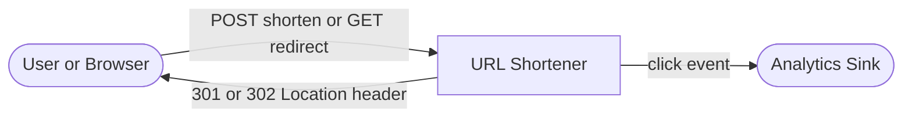
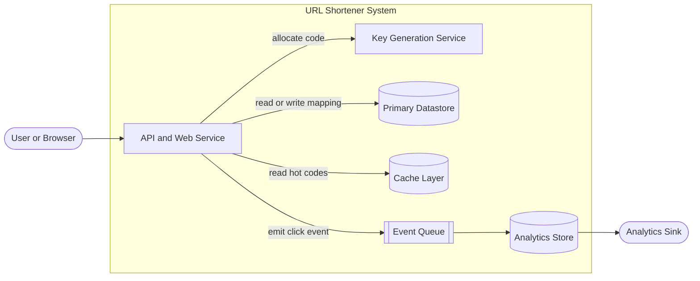
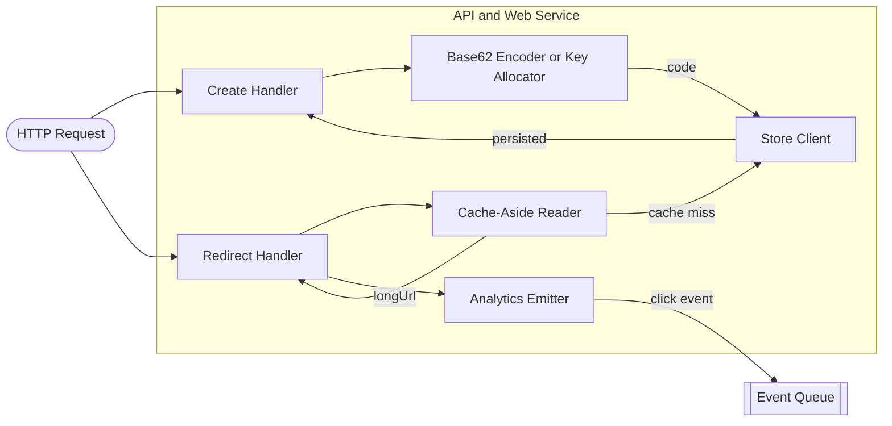

# URL Shortener

## Overview & use case

- **What it is / who uses it:** A service that maps long URLs to short alphanumeric codes (e.g. `sho.rt/aB3xYz`) and redirects browsers instantly. Used by marketing platforms (Bitly, TinyURL), social media, and QR-code campaigns.
- **Core use cases:** Shorten a URL (optional custom alias); redirect short code → long URL; per-link click analytics (count, referrer, geo); link expiry.
- **Functional requirements:** Create short code for any URL; support custom aliases; redirect with correct HTTP status; record click events; codes must never be reused after expiry.
- **Non-functional requirements (scale):** 100M new URLs per year (~3 writes/s average, burst to ~500/s); tens of thousands of redirects per second (read:write ≈ 100:1); redirect p99 < 50ms; 99.99% availability; data retention of codes indefinitely (or per TTL); analytics can be eventually consistent.
- **Key constraints / assumptions:** Short codes are 6–8 characters Base62 (62^6 ≈ 56B unique codes, plenty for decades); no collisions or reuse; analytics pipeline is asynchronous (doesn't block the redirect).

## C1 — System context

> A user or browser sends a create or redirect request to the URL Shortener, which optionally pushes click events to an analytics sink.

The URL Shortener is the single system; it is the only component that talks to external parties. The Analytics Sink (e.g. Kafka, a time-series DB, or a vendor like Segment) receives events asynchronously.

## C2 — Containers

> The deployable units and their communication paths.

- **API and Web Service** — Stateless HTTP service (Node/Go/Java). Handles both the `POST /shorten` and `GET /:code` endpoints. Horizontally scalable behind a load balancer.
- **Key Generation Service (KGS)** — A small, dedicated service that pre-allocates batches of unique codes. Decouples code uniqueness guarantees from the hot redirect path. Alternative: monotonic counter + Base62 encoding in the API service itself.
- **Primary Datastore** — Stores the canonical `code → {longUrl, createdAt, expiresAt, owner}` mapping. PostgreSQL or DynamoDB both work; see trade-offs below.
- **Cache Layer** — Redis or Memcached holding the hottest `code → longUrl` mappings. Absorbs the vast majority of redirect reads.
- **Event Queue** — Kafka or SQS. API emits a lightweight click event and returns immediately; the queue decouples analytics writes from the redirect latency.
- **Analytics Store** — ClickHouse or BigQuery. Aggregates click events for dashboards and reporting.

## C3 — Components

> Components inside the API and Web Service.

- **Create Handler** — Validates the input URL, checks for custom-alias conflicts, calls the Key Allocator, persists the mapping, returns the short URL.
- **Base62 Encoder / Key Allocator** — Either calls the KGS to pop a pre-generated code from a pool, or increments a distributed atomic counter and encodes it as Base62.
- **Store Client** — Thin wrapper over the database driver. Handles connection pooling, retries, and translates domain objects to DB rows.
- **Redirect Handler** — Resolves `/:code` using the Cache-Aside Reader; issues the HTTP redirect; fires an analytics event.
- **Cache-Aside Reader** — Checks Redis first. On miss: reads from the primary datastore, writes the result back to Redis with a TTL, returns the long URL.
- **Analytics Emitter** — Serialises a click event (code, timestamp, IP, referrer, user-agent) and publishes to the Event Queue. Fire-and-forget; does not block the response.

## Dynamic — Create flow

1. Client `POST /shorten` with `{longUrl, customAlias?, expiresAt?}`.
2. **Create Handler** validates the URL (parse, scheme whitelist, max length).
3. If custom alias: check uniqueness in the datastore; return `409 Conflict` if taken.
4. Otherwise: **Key Allocator** requests a code from the KGS (or increments counter + Base62-encodes).
5. **Store Client** writes `{code, longUrl, createdAt, expiresAt}` to the primary datastore.
6. Response: `201 Created` with `{"shortUrl": "https://sho.rt/aB3xYz"}`.

## Dynamic — Redirect flow

1. Browser `GET /aB3xYz`.
2. **Cache-Aside Reader** checks Redis for key `redirect:aB3xYz`.
3. **Cache hit** → return `longUrl` in ~1ms.
4. **Cache miss** → **Store Client** queries primary datastore.
   - Not found or expired → `404 Not Found`.
   - Found → write to Redis (TTL 24h), return `longUrl`.
5. **Redirect Handler** issues `302 Found` with `Location: <longUrl>`.
6. **Analytics Emitter** publishes click event to queue (async, after response sent).

## Trade-offs & where it breaks

**Key generation strategy**

| Approach | Pros | Cons |
|----------|------|------|
| Random hash + collision check | Simple, no coordination | Collision probability grows; extra read per write |
| Monotonic counter + Base62 | Zero collisions, O(1) encode | Counter is a single point of contention; sequential codes are guessable |
| Pre-allocated key pool (KGS) | Collision-free, fast, decoupled | Extra service to operate; pool exhaustion on KGS failure |

KGS is the most operationally sound at scale: each API node claims a batch of codes (e.g. 1000 at a time) and distributes them locally without coordination until the batch is exhausted. A KGS crash only loses unissued codes in memory — all persisted mappings are safe.

**301 vs 302 redirect**

`301 Moved Permanently` is cacheable by browsers and CDNs: subsequent redirects for the same code never reach the service, dramatically reducing load. The cost is that you lose per-click analytics (the browser never calls you again). `302 Found` forces a round-trip every time, giving accurate click counts at the cost of latency and server load. Choose `302` when analytics matter; expose a `301` option for power users who opt out of tracking.

**Caching strategy and hot keys**

A small fraction of codes (viral links) accounts for the majority of redirects. Cache-aside with a long TTL works well, but a single Redis node can become a bottleneck for a truly viral key. Mitigations: read replicas, local in-process caching (small LRU per API pod), or a CDN edge cache for the redirect response itself.

**SQL vs KV store**

PostgreSQL gives ACID guarantees, secondary indexes (owner → all codes, expiry sweeps), and familiar tooling. DynamoDB or Cassandra give near-linear write scalability but lack flexible queries. At 3 writes/s average the write load is trivial; the datastore choice should be driven by the query patterns for analytics and admin (list all links by owner, bulk expiry), where SQL wins.

**Custom-alias collision**

Two concurrent requests for the same alias can both read "not taken" and attempt an insert. Use a unique index on the alias column (or a conditional write in DynamoDB) so the second insert fails with a clear conflict error; return `409` to the client.

**Abuse and expiry**

Short URLs are a phishing vector. Mitigations: URL blocklist check at creation time (Google Safe Browsing API), rate-limit creation per IP/key, scan destination on first redirect. Expired codes should be soft-deleted (retain the row) to prevent code reuse; a nightly background job moves them to an archive table.

**Failure modes**

- **Primary datastore down** — Cache-served codes keep redirecting; new creates fail with `503`. Use a read replica to serve redirects during write unavailability.
- **KGS down** — Fall back to local counter + Base62; risk of collision between nodes is low for short bursts if counters are seeded differently per node (using node ID prefix).
- **Cache eviction storm** — A cache flush sends all traffic to the datastore simultaneously. Use cache warming (pre-populate top-N codes) and staggered TTLs with jitter.

**Observability signals to monitor:** redirect latency p50/p99, cache hit rate, `404` rate (broken links), KGS pool depth, queue consumer lag (analytics freshness).
