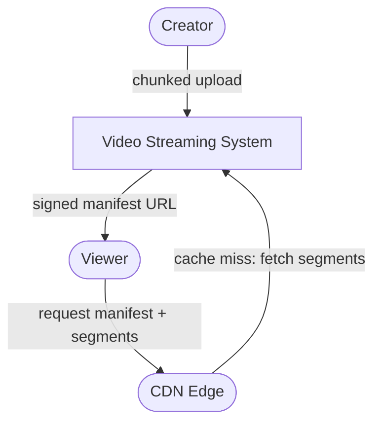
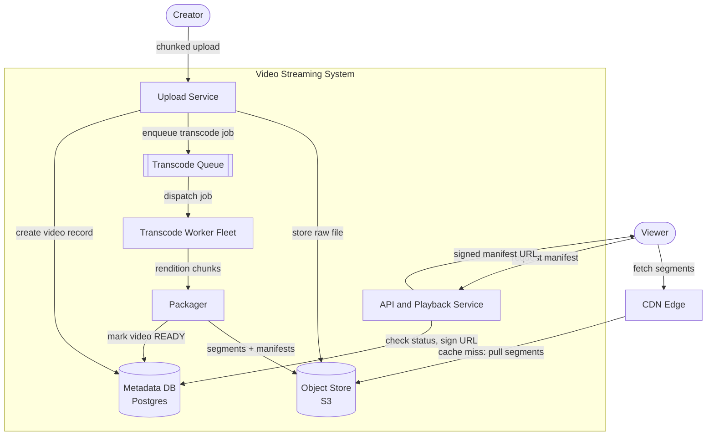
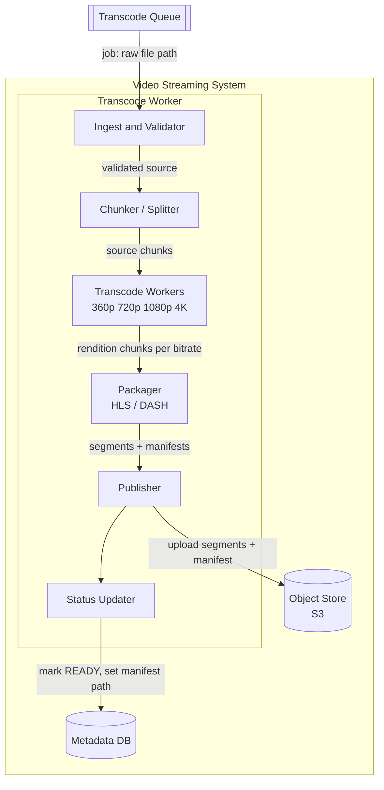

# Video Streaming

## Overview & use case

- **What it is / who uses it:** A video-on-demand platform — creators upload raw video files; the system transcodes, packages, and stores them; viewers stream the result smoothly on any device and network. Core product surface for YouTube, Netflix, TikTok, Vimeo.
- **Core use cases:** Creator uploads a video; viewer plays it with adaptive quality.
- **Functional requirements:** Creators can upload large video files (chunked/resumable); uploaded videos are transcoded into multiple bitrate renditions; packaged into HLS or DASH segments with manifests; videos have a lifecycle status (processing → ready); viewers can request a video manifest and stream segments; access can be gated by signed URLs or DRM.
- **Non-functional requirements (scale):** Petabytes of stored video; ~500 hours of video uploaded per minute (YouTube scale); millions of concurrent viewers; CDN egress in Tbps range; playback start-time p99 < 1s globally; 99.99% availability for playback; read-dominated (watch:upload ratio ~10,000:1); transcode turnaround p99 < 5 min for a 10-min video.
- **Key constraints / assumptions:** Focus on VOD (live streaming is a variant noted in trade-offs); global low-latency delivery mandates CDN; storing N bitrate renditions multiplies storage cost — rendition count is a cost lever; egress from object storage is expensive, making CDN cache-hit ratio critical.

## C1 — System context

> Who/what interacts with the system; the entire Video Streaming system is one box.

The Video Streaming System handles the write path (upload, transcode, package, publish) and the read path (manifest serving, auth). Segments are delivered at scale by the CDN; the system acts as CDN origin. Creators interact directly; viewers interact primarily with CDN edges.

## C2 — Containers

> Deployable units and how they communicate.

- **Upload Service** — handles chunked, resumable uploads (e.g. TUS protocol); validates file type/size; writes raw file to Object Store; creates a `video` record (status: `processing`) in Metadata DB; enqueues a transcode job. Tech: Go, stateless, horizontally scaled.
- **Object Store (S3)** — stores raw uploaded files, transcoded rendition chunks, HLS/DASH segments, manifests, and thumbnails. Source of truth for all media bytes. Lifecycle policies move cold/unpopular videos to cheaper storage tiers.
- **Transcode Queue** — durable job queue (e.g. SQS or Kafka) that decouples upload from compute-intensive transcoding. Absorbs upload spikes; workers consume at their own pace. Dead-letter queue for failed jobs.
- **Transcode Worker Fleet** — auto-scaled fleet of CPU/GPU workers that pull jobs from the queue; each worker splits the source file into chunks, runs parallel transcode across bitrates, and forwards output to Packager. Tech: C++ ffmpeg wrappers or cloud media services (AWS MediaConvert).
- **Packager** — receives rendition chunks from workers; segments video into ~2–6s HLS/DASH chunks; generates `.m3u8`/`.mpd` manifests listing all renditions and segment URLs; uploads everything to Object Store; marks video `READY` in Metadata DB.
- **Metadata DB (Postgres)** — stores video records (id, owner, title, status, manifest path, duration, renditions, created/updated timestamps). Source of truth for video lifecycle state. Horizontally read-scaled with replicas.
- **API and Playback Service** — handles viewer requests: checks video status in Metadata DB; generates signed CDN URLs for the manifest; returns the manifest URL to the player. Also serves creator upload initiation, video management, search hooks. Tech: Node.js or Go, stateless.
- **CDN Edge** — caches and delivers segments to viewers globally. Cache-hit ratio is the primary cost and latency lever. On cache miss, CDN pulls from Object Store (origin). Signed URLs and token-based auth prevent unauthorized access.

## C3 — Components inside the Transcode Worker Fleet

> Internal components of the most interesting container.

- **Ingest and Validator** — downloads or streams the raw file from Object Store; validates codec, container format, duration, and file integrity. Rejects corrupt files early and writes error status to Metadata DB.
- **Chunker / Splitter** — splits the source into fixed-duration chunks (e.g. 30s) at I-frame boundaries to enable parallel transcode. More chunks = more parallelism = faster turnaround; diminishing returns above ~20 chunks.
- **Transcode Workers** — one worker per rendition per chunk; produce multiple bitrate/resolution renditions (e.g. 360p/800Kbps, 720p/2.5Mbps, 1080p/5Mbps, 4K/15Mbps). Parallelism is the primary lever for transcode speed; workers are ephemeral and autoscaled.
- **Packager (HLS/DASH)** — assembles rendition chunks into 2–6s segments; generates the master manifest listing all renditions, and per-rendition sub-manifests listing segment URLs. HLS is dominant for Apple; DASH for Android/Web. CMAF enables a single segmentation to serve both.
- **Publisher** — uploads all segments and manifests to Object Store under a structured key prefix; optionally pre-warms CDN edges by issuing early fetch requests for popular/anticipated videos.
- **Status Updater** — writes the final `READY` status and manifest path to Metadata DB so the Playback Service can serve the video.

## Dynamic — upload-to-ready and playback

### (a) Upload → transcode → publish

1. **Creator** initiates upload; **Upload Service** returns a chunked-upload session ID.
2. Creator uploads file in chunks (e.g. 5MB each); **Upload Service** assembles and writes raw file to **Object Store**; creates `video` record (status `processing`) in **Metadata DB**.
3. **Upload Service** enqueues `{video_id, raw_file_path}` to **Transcode Queue**.
4. **Transcode Worker** picks up job; **Ingest/Validator** fetches raw file from Object Store and validates.
5. **Chunker** splits source into N chunks at I-frame boundaries; dispatches N × R parallel transcode tasks (N chunks × R renditions).
6. **Transcode Workers** (fleet) run ffmpeg in parallel; output rendition chunks.
7. **Packager** assembles chunks per rendition into HLS/DASH segments and manifests.
8. **Publisher** uploads all segments and manifests to **Object Store**; optionally pre-warms CDN.
9. **Status Updater** writes `READY` + manifest path to **Metadata DB**. Video is now streamable.

### (b) Playback via manifest + ABR + CDN

1. **Viewer** opens video; player requests manifest from **API and Playback Service**.
2. Service checks **Metadata DB** — video is `READY`; generates a signed CDN URL for the master manifest; returns it to the player.
3. Player fetches master manifest from **CDN Edge** (likely a cache hit within seconds of publish); manifest lists all renditions with their sub-manifest URLs.
4. Player's **ABR (Adaptive Bitrate)** algorithm measures available bandwidth and buffer level; selects the appropriate rendition (e.g. 720p).
5. Player fetches 2–6s segments from nearest **CDN Edge** (cache hit — served from edge PoP at ~10ms). Cache miss: CDN pulls segment from **Object Store** (origin shield pattern prevents thundering-herd on origin).
6. As network conditions change, ABR switches renditions mid-stream; player fetches subsequent segments at the new bitrate. Seamless quality switching is invisible to the viewer.

## Trade-offs & where it breaks

### Adaptive bitrate streaming — HLS vs DASH

Both segment video into short chunks with a manifest; ABR selects bitrate based on bandwidth and buffer. Storing N renditions multiplies storage and transcode cost linearly — a 1-hour 4K video at 5 renditions uses ~5× the raw storage. CMAF reduces this by sharing a single segmentation for both HLS and DASH, halving segment storage at the cost of encoder complexity.

### CDN as the scaling lever for reads

Playback is almost entirely CDN-served; the origin (Object Store + Playback Service) only sees cache misses. Cache-hit ratio is the dominant cost and latency driver. Optimizations: long `Cache-Control` TTL on immutable segments; **origin shielding** (a single regional cache layer between CDN edge and S3 prevents thundering-herd on origin during viral events); signed URLs or DRM tokens validated at CDN edge, not origin.

### Async parallel transcoding

Chunked source → fan-out to worker fleet → reassemble enables sub-5-minute turnaround for a 10-minute video even on a single transcode cluster. Queue backpressure under upload spikes is handled by autoscaling the worker fleet (target: queue depth < 500 jobs). Dead-letter queues capture failed jobs for retry or human review.

### Pre-transcode all renditions vs on-the-fly transcoding

Pre-transcode (offline): predictable cost, fast first-play, multiplied storage for long-tail catalog. On-the-fly (JIT): storage-efficient, but adds first-view latency and bursts compute at watch time. Common hybrid: pre-transcode top N renditions (720p, 1080p); generate 4K and 360p on demand. Alternatively, perceptual quality ladders (VMAF-based) generate fewer renditions for simple content, reducing storage cost 20–40%.

### Storage tiering for long-tail catalog

Popular videos remain in hot storage (S3 Standard); videos with fewer than X views/month move to cold storage (S3 Glacier Instant Retrieval). Manifests always remain hot; only segments are tiered. Retrieval latency for cold segments is ~100ms — acceptable for non-popular content; a warm-up job can promote segments before a scheduled event.

### VOD vs live streaming

Live adds: real-time ingest (RTMP/SRT), chunked encoding with 1–2s segment latency, push-based CDN invalidation, and much tighter packaging pipelines (no offline chunking). Low-latency live (LL-HLS, LLDASH) targets < 3s glass-to-glass latency, requiring partial segment delivery and server push.

### Where it breaks

- **Viral upload overwhelming origin** — CDN shielding + pre-warm on trending content; rate-limit origin fetches per video.
- **Transcode backlog under upload spikes** — autoscale worker fleet; priority queue for premium creators; fast-path for short clips.
- **Cost explosion from too many renditions** — VMAF-based adaptive ladder generation; storage tiering; delete raw file after transcode.
- **Thumbnail/preview generation** — separate lightweight worker; sprite sheets for scrubbing previews add storage but reduce seek latency.
- **Consistency of manifest vs segments** — segments must be fully uploaded before the manifest is published; Status Updater writes `READY` only after Publisher confirms all uploads, preventing players from fetching a manifest that points to not-yet-uploaded segments.
