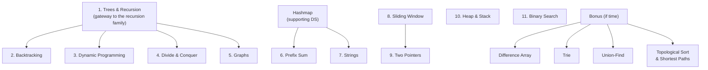

# DSA Roadmap

This is the order I'm learning DSA in, and why. Each topic builds on the previous — the sequence matters.

---

## Start here — the interview method

Patterns get you to a solution; method gets you through the room.

- [Interview Process (UMPIRE)](./interview-process) — a 6-step loop so you never freeze
- [Communication & Whiteboard](./communication) — how to think out loud and present code
- [Big-O Primer](./big-o) — reason about trade-offs
- [Study Plan](./study-plan) — 1 / 2 / 6-week roadmaps + a curated problem set

> Philosophy: **learn patterns, not problems.** Internalize a pattern and new problems become variations. Always plan your own approach before reading any solution.

---

## Group 1 — The Recursion Family (built on Tree)

> "We can learn about recursion: Base case; Recurrence Relation; How children respond to their parents; DFS, BFS."

Tree is the gateway. Once you understand how a tree node delegates work to its children and combines results on the way back up, the rest of this group follows naturally.

1. [Trees & Recursion](./tree) — the foundation
2. [Backtracking](./backtracking) — explore all paths, prune bad ones
3. [Dynamic Programming](./dynamic-programming) — memoize overlapping sub-problems
4. [Divide and Conquer](./divide-and-conquer) — split, solve, merge
5. [Graphs](./graph) — generalized trees with cycles
6. [Linked List](./linked-list) — foundational node-chain structure; pointer manipulation practice for tree/graph work

---

## Group 2 — Hashmap as a Supporting DS

> "We can use this one as a supporting DS: Frequency; Memorize (memoize); Access key with O(1). Note: Anything can be a key."

Hashmap rarely stands alone — it amplifies every other technique.

- [Hashmap](./hashmap) — the universal supporting structure
- 6. [Prefix Sum](./prefix-sum) — range queries powered by a hashmap
- 7. [Strings](./strings) — frequency maps, anagram detection, window tricks

---

## Group 3 — Sliding Window → Two Pointers

8. [Sliding Window](./sliding-window) — variable-length window that grows/shrinks to satisfy a condition
9. [Two Pointers](./two-pointers) — "main algorithm to check the sub-array with given conditions; slow-fast pointers; opposite-ends pointers"
10. [Intervals](./intervals) — merge/insert/sweep; an array-scan technique that pairs naturally with two-pointer thinking

---

## Group 4 — Heap & Stack

11. [Heap & Stack](./heap-stack) — combined with hashmap, extremely useful in system design; "top is the most important thing"
- [Greedy](./greedy) — the counterpart to DP: when the exchange argument holds, take the locally optimal choice; no memoization needed

---

## Group 5 — Binary Search

11. [Binary Search](./binary-search) — "define what to search, and the validation function is the most important thing"

---

## Bonus (if you have time)

- [Difference Array](./difference-array) — range updates in O(1)
- [Trie](./trie) — prefix tree; I like this one a lot
- [Union-Find (DSU)](./union-find) — connectivity queries
- [Bit Manipulation](./bit-manipulation) — XOR tricks, masks, power-of-2 checks; surprisingly common in hard problems
- [Topological Sort & Shortest Paths](./topological-shortest-path) — Kahn's + Dijkstra

---

## Further reading

- [EngineerPro — Coding DSA Interview at Big Tech](https://engineerpro-team.github.io/coding-book/) — 288 worked problems organized by pattern; the source this roadmap's interview-method notes draw on.
