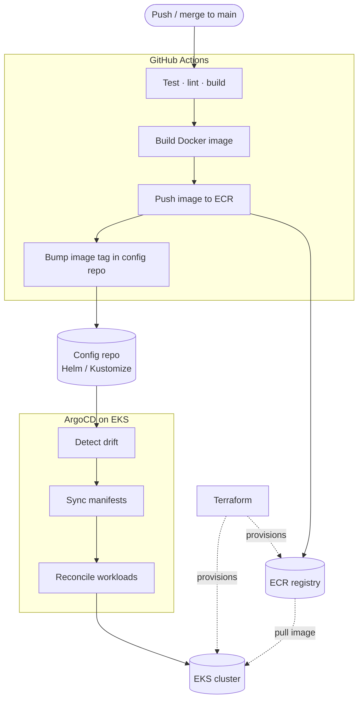

# DevOps Stack & Flow

How I actually ship: a **GitOps** pipeline where CI builds and publishes immutable
images, and CD is a pull-based reconciliation loop that keeps the cluster matching Git.

## The flow

**The split that matters:** GitHub Actions never touches the cluster (no `kubectl apply`
from CI). It only produces two artifacts — an image in ECR and a Git commit bumping the
tag. ArgoCD, running *inside* EKS, pulls those changes. Git is the single source of truth;
the cluster converges to it.

## Stack

| Tool | Role | Status | Notes |
|------|------|--------|-------|
| GitHub Actions | CI | `daily` | Test, lint, build image, push to ECR, bump tag in config repo |
| ECR | Image registry | `daily` | Private registry; immutable tags (e.g. git SHA), lifecycle policies prune old images |
| ArgoCD | CD (GitOps) | `daily` | Runs in-cluster; reconciles desired state from the config repo to EKS |
| EKS | Orchestration | `daily` | Managed Kubernetes; runs workloads + ArgoCD itself |
| Terraform | IaC | `daily` | Provisions EKS, ECR, VPC, IAM, node groups — the foundation under everything |

## Why GitOps (pull) over push CD

::: details Push CD vs Pull CD (GitOps)
**Push (CI deploys):** CI holds cluster credentials and runs `kubectl apply` / `helm upgrade`.
Simple, but CI has standing write access to prod, drift is invisible, and rollback means
re-running a pipeline.

**Pull (GitOps):** an in-cluster agent (ArgoCD) watches Git and reconciles. Benefits:
- **No cluster creds in CI** — smaller blast radius; the agent pulls, CI never reaches in.
- **Git is the audit log** — every change is a reviewed, revertible commit. Rollback = `git revert`.
- **Drift detection** — ArgoCD continuously flags/heals manual `kubectl` changes.
- **Self-healing** — desired state is reasserted automatically.

Trade-off: an extra moving piece (the agent) and a config/repo split to maintain.
:::

::: details App code vs config repo
A common GitOps layout is **two repos** (or two paths):
- **App repo** — source code; CI builds the image and *opens a commit/PR* against the config repo.
- **Config repo** — Helm values / Kustomize overlays; the desired state ArgoCD watches.

This keeps deploy history separate from code history and lets ArgoCD watch one clean source
of truth. A single repo with a `deploy/` path works too for smaller setups.
:::

::: details Where Terraform fits
Terraform owns the **layer below GitOps**: the EKS cluster, ECR repos, VPC/subnets, IAM
roles (IRSA), and node groups. Rule of thumb — *Terraform provisions the platform; ArgoCD
deploys the apps onto it.* Bootstrapping ArgoCD itself is the seam: install it via Terraform
(or Helm) once, then let it manage everything else ("app of apps").
:::

*Edit to match your stack.*
